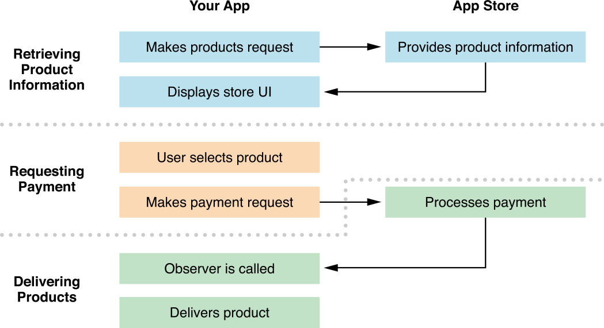

# About In-App Purchase

In-App Purchase allows you to embed a store inside your app using the Store Kit framework. This framework connects to the App Store on your app’s behalf to securely process payments from users, prompting them to authorize payment. The framework then notifies your app, which provides the purchased items to users. Use In-App Purchase to collect payment for additional features and content.

内置购买使用 Store Kit 框架在应用程序里内置一个商店。该框架把你的应用程序的行为连接到应用商店来安全地处理用户的支付，促使他们授权支付。 然后框架给你的应用程序发送通知，该应用程序提供了用户购买的商品。使用内置购买可以为额外的功能和内容提供支付。

For example, using In-App Purchase, you can implement the following scenarios:

比如，使用内置购买，你可以实现以下内容：

- A basic version of your app with additional premium features

一个带有额外高级功能的应用程序的基础版本。

- A magazine app that lets users purchase and download new issues

一个可以让用户购买和下载新刊的杂志应用。

- A game that offers new levels to explore

一个提供新关卡让用户攻克的游戏。

- An online game that allows players to purchase virtual property

一个允许玩家购买虚拟资产在线游戏。

## At a Glance
概论
At a high level, the interactions between the user, your app, and the App Store during the In-App Purchase process take place in three stages, as shown in Figure I-1. First, the user navigates to your app’s store and your app displays its products. Second, the user selects a product to buy and the app requests payment from the App Store. Third, the App Store processes the payment and your app delivers the purchased product.

从高层次来说，内置购买过程处理期间，用户，应用程序和应用商店之间的交互发生在三个阶段，如图 I-1。首先，用户导航到你的应用程序商店，你的应用程序显示其产品。 其次，用户选择一个产品购买，应用程序从应用商店请求支付。 最后，应用商店处理该支付，你的应用程序传递被购产品。

Figure I-1  Stages of the purchase process
图 I-1 购买过程的阶段

### You Create and Configure Products in iTunes Connect
一、在 iTunes Connect 里创建和配置产品
Understanding what kinds of products and behaviors are supported by In-App Purchase lets you design your app and in-app store to make the best use of this technology.

理解内置购买支持哪些产品和行为让你最大化使用该技术来设计应用程序和内置商店。

Relevant Chapter: [“Designing Your App’s Products”](https://developer.apple.com/library/ios/documentation/NetworkingInternet/Conceptual/StoreKitGuide/Chapters/Products.html#//apple_ref/doc/uid/TP40008267-CH2-SW2)

 相关章节：[“Designing Your App’s Products”](https://developer.apple.com/library/ios/documentation/NetworkingInternet/Conceptual/StoreKitGuide/Chapters/Products.html#//apple_ref/doc/uid/TP40008267-CH2-SW2)

### Your App Interacts with the App Store to Sell Products
二、应用程序跟应用商店交互来出售产品
All apps that use In-App Purchase need to implement the core functionality described in these chapters to let users make purchases and then deliver the purchased products.

所有使用内置购买的应用程序都需要实现这些章节中描述的内核功能，让用户可以购买然后传递已购的产品。

These development tasks need to be done in order. The relevant chapters introduce them in the order you implement them, and they’re listed in full in[“Implementation Checklist.”](https://developer.apple.com/library/ios/documentation/NetworkingInternet/Conceptual/StoreKitGuide/Chapters/AppReview.html#//apple_ref/doc/uid/TP40008267-CH10-SW4) To help plan your development, you may want to read the full checklist before you begin.

这些开发任务需要按顺序完成。 相关章节按照你实现它们的顺序介绍，它们在“Implementation Checklist.”中有完整列表来帮助你计划你的开发，你可以在开始前先阅读完整的清单。

Relevant Chapters: [“Retrieving Product Information,” ](https://developer.apple.com/library/ios/documentation/NetworkingInternet/Conceptual/StoreKitGuide/Chapters/ShowUI.html#//apple_ref/doc/uid/TP40008267-CH3-SW5)[“Requesting Payment,” ](https://developer.apple.com/library/ios/documentation/NetworkingInternet/Conceptual/StoreKitGuide/Chapters/RequestPayment.html#//apple_ref/doc/uid/TP40008267-CH4-SW2)[“Delivering Products”](https://developer.apple.com/library/ios/documentation/NetworkingInternet/Conceptual/StoreKitGuide/Chapters/DeliverProduct.html#//apple_ref/doc/uid/TP40008267-CH5-SW3)

相关章节：[“Retrieving Product Information,” ](https://developer.apple.com/library/ios/documentation/NetworkingInternet/Conceptual/StoreKitGuide/Chapters/ShowUI.html#//apple_ref/doc/uid/TP40008267-CH3-SW5)[“Requesting Payment,” ](https://developer.apple.com/library/ios/documentation/NetworkingInternet/Conceptual/StoreKitGuide/Chapters/RequestPayment.html#//apple_ref/doc/uid/TP40008267-CH4-SW2)[“Delivering Products”](https://developer.apple.com/library/ios/documentation/NetworkingInternet/Conceptual/StoreKitGuide/Chapters/DeliverProduct.html#//apple_ref/doc/uid/TP40008267-CH5-SW3)

### Subscriptions Require Additional Application Logic
三、订阅需要更多应用逻辑
Apps that offer subscriptions need to keep track of when the user has an active subscription, respond to expiration and renewal, and determine what content the user has access to.

提供订阅的应用程序需要随时监控用户何时有一个活动订阅，响应到期和续期，然后决定用户访问什么内容。

Relevant Chapter: [“Working with Subscriptions”](https://developer.apple.com/library/ios/documentation/NetworkingInternet/Conceptual/StoreKitGuide/Chapters/Subscriptions.html#//apple_ref/doc/uid/TP40008267-CH7-SW6)

相关章节：[“Working with Subscriptions”](https://developer.apple.com/library/ios/documentation/NetworkingInternet/Conceptual/StoreKitGuide/Chapters/Subscriptions.html#//apple_ref/doc/uid/TP40008267-CH7-SW6)

### Users Can Restore Purchases
四、用户可以恢复购买
Users can restore products that they previously purchased—for example, to bring content they’ve already paid for onto their new phone.

用户可以恢复它们先前已经购买的产品--比如，可以把购买产品给新的手机使用。

Relevant Chapter: “Restoring Purchased Products”

相关章节：“Restoring Purchased Products”

### Apps and Products Are Submitted for Review
五、应用程序和产品需要提交审核
When you’re done developing and testing, you submit your app and your In-App Purchase products for review.

当你完成开发和测试后，你需要提交你的应用程序和内置购买产品以供审核。

Relevant Chapter:[“Preparing for App Review”](https://developer.apple.com/library/ios/documentation/NetworkingInternet/Conceptual/StoreKitGuide/Chapters/AppReview.html#//apple_ref/doc/uid/TP40008267-CH10-SW1)

相关章节：[“Preparing for App Review”](https://developer.apple.com/library/ios/documentation/NetworkingInternet/Conceptual/StoreKitGuide/Chapters/AppReview.html#//apple_ref/doc/uid/TP40008267-CH10-SW1)

### See Also
参见
- [In-App Purchase Configuration Guide for iTunes Connect ](https://developer.apple.com/library/ios/documentation/LanguagesUtilities/Conceptual/iTunesConnectInAppPurchase_Guide/Chapters/Introduction.html#//apple_ref/doc/uid/TP40013727)describes how to create and configure your app’s products in iTunes Connect.

描述了如何在 iTunes Connect 里创建和配置应用程序的产品。

- [Receipt Validation Programming Guide](https://developer.apple.com/library/ios/releasenotes/General/ValidateAppStoreReceipt/Introduction.html#//apple_ref/doc/uid/TP40010573) describes how to work with receipts, in particular with the record of successful in-app purchases.