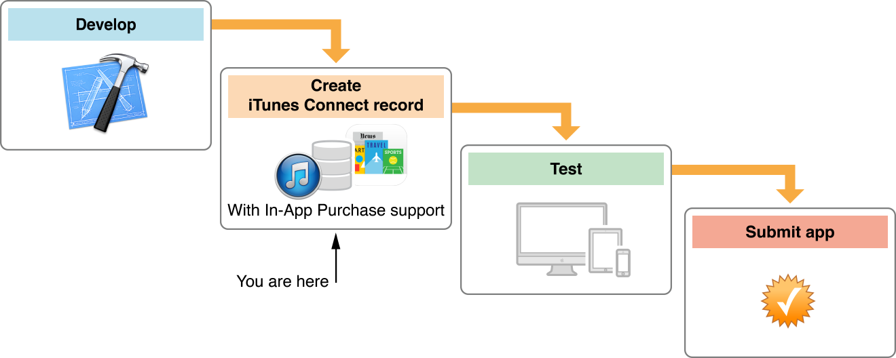

# Introduction

In-App Purchase is an Apple technology that allows your users to purchase content and services from within your app. You set up In-App Purchase products through iTunes Connect, a suite of web-based tools. You implement In-App Purchase in your app using the Store Kit framework.

内置购买是一种苹果技术，它允许用户从你的应用内部购买内容和服务。你可以通过一套基于网络的工具在iTunes Connect设置内置购买。 你使用商店Kit框架在应用中实现内置购买。

For example, you can use In-App Purchase to implement any of the following scenarios:

举个例子，你可以使用内置购买来实现以下任何场景：

- A basic version of your app with additional premium features

带有额外高级功能的应用程序的一个基本版本。

- A book reader app that allows the user to purchase and download new books

一个允许用户购买和下载新书的阅读器应用。

-A game that offers new environments (levels) to explore

一个给用户提供更多关卡的游戏。

- A game that allows players to purchase virtual property

一个允许用户购买虚拟财产的游戏。

- An app that provides access to a turn-by-turn map service

一个提供全方位地图服务的应用。

- A subscription to a digital magazine or newsletter

一个数字杂志或通讯的订阅应用。

After you’ve designed one or more products to make available in your app, you’re ready to add In-App Purchase configuration information in iTunes Connect.

当你在你的应用中设计好一个或多个产品时，你就以及准备好在iTunes Connect中添加内置购买配置信息了。

If you aren’t already familiar with In-App Purchase, read [Getting Started with In-App Purchase on iOS and OS X ](https://developer.apple.com/in-app-purchase/In-App-Purchase-Guidelines.pdf)and [Adding In-App Purchase to your iOS and Mac Applications](https://developer.apple.com/library/ios/technotes/tn2259/_index.html). If you aren’t already familiar with iTunes Connect, read [iTunes Connect Developer Guide](https://developer.apple.com/library/ios/documentation/LanguagesUtilities/Conceptual/iTunesConnect_Guide/Chapters/About.html#//apple_ref/doc/uid/TP40011225).

如果你对内置购买还不熟悉，请看[Getting Started with In-App Purchase on iOS and OS X ](https://developer.apple.com/in-app-purchase/In-App-Purchase-Guidelines.pdf) 和 [Adding In-App Purchase to your iOS and Mac Applications](https://developer.apple.com/library/ios/technotes/tn2259/_index.html). 如果你不熟悉iTunes Connect，请看 [iTunes Connect Developer Guide](https://developer.apple.com/library/ios/documentation/LanguagesUtilities/Conceptual/iTunesConnect_Guide/Chapters/About.html#//apple_ref/doc/uid/TP40011225).

## At a Glance

一、概述

Use iTunes Connect to add, set up testing for, submit, and manage your In-App Purchase product configurations.

使用iTunes Connect 来添加，配置测试，提交，以及管理你的内置购买产品配置。

### Configure Your In-App Purchase Products
1、配置你的内置购买产品

After you’ve created an iTunes Connect record for your app, you can configure the In-App Purchase products that you want to make available through your app.

当你为你的应用创建了一个iTunes Connect记录后，你可以配置内置购买产品，这些产品将在你的应用中出售。

Related Chapters: [“Creating In-App Purchase Products,”](https://developer.apple.com/library/ios/documentation/LanguagesUtilities/Conceptual/iTunesConnectInAppPurchase_Guide/Chapters/CreatingInAppPurchaseProducts.html#//apple_ref/doc/uid/TP40013727-CH3-SW1) [“Displaying Products in More Than One Language”](https://developer.apple.com/library/ios/documentation/LanguagesUtilities/Conceptual/iTunesConnectInAppPurchase_Guide/Chapters/DisplayingInMoreLanguages.html#//apple_ref/doc/uid/TP40013727-CH32-SW1)

相关章节：[“Creating In-App Purchase Products,”](https://developer.apple.com/library/ios/documentation/LanguagesUtilities/Conceptual/iTunesConnectInAppPurchase_Guide/Chapters/CreatingInAppPurchaseProducts.html#//apple_ref/doc/uid/TP40013727-CH3-SW1)    [“Displaying Products in More Than One Language”](https://developer.apple.com/library/ios/documentation/LanguagesUtilities/Conceptual/iTunesConnectInAppPurchase_Guide/Chapters/DisplayingInMoreLanguages.html#//apple_ref/doc/uid/TP40013727-CH32-SW1)

### Test Your In-App Purchase Products
2.测试你的内置购买产品

Test the In-App Purchase products you’ve configured to make sure they appear in your app’s store and to make sure that financial transactions work properly.

测试你已经配置的内置购买产品，确保它们出现在你的应用商店，以及确保顺利地完成财务交易工作。

Related Chapters: [“Testing In-App Purchase Products”](https://developer.apple.com/library/ios/documentation/LanguagesUtilities/Conceptual/iTunesConnectInAppPurchase_Guide/Chapters/TestingInAppPurchases.html#//apple_ref/doc/uid/TP40013727-CH4-SW1)

相关章节：[“Testing In-App Purchase Products”](https://developer.apple.com/library/ios/documentation/LanguagesUtilities/Conceptual/iTunesConnectInAppPurchase_Guide/Chapters/TestingInAppPurchases.html#//apple_ref/doc/uid/TP40013727-CH4-SW1)

### Submit Your In-App Purchase Products for Review
3.上传你的内置购买产品以供审核

After you’ve included all the information for a product and tested to make sure it appears in your app’s store, you are ready to submit the product for review and to make it available on the store.

当你包含了产品的所有信息之后，测试它以确保它能出现在你的应用商店，这样你就可以准备发布该产品以供审核，并让它能在商店里出售。

Related Chapters: [“Submitting In-App Purchase Products”](https://developer.apple.com/library/ios/documentation/LanguagesUtilities/Conceptual/iTunesConnectInAppPurchase_Guide/Chapters/SubmittingInAppPurchases.html#//apple_ref/doc/uid/TP40013727-CH5-SW1)

相关章节： [“Submitting In-App Purchase Products”](https://developer.apple.com/library/ios/documentation/LanguagesUtilities/Conceptual/iTunesConnectInAppPurchase_Guide/Chapters/SubmittingInAppPurchases.html#//apple_ref/doc/uid/TP40013727-CH5-SW1)

Manage the In-App Purchase Products Available in Your App
4.管理应用程序中的内置购买产品

After an In-App Purchase product is approved and ready for sale, you can continue to manage its display, pricing, and availability on the store.

当内置购买产品审核通过并准备好出售后，你可以继续管理它的显示，价格以及它的可用性。

Related Chapters: [“Working with Your Product’s Status,”](https://developer.apple.com/library/ios/documentation/LanguagesUtilities/Conceptual/iTunesConnectInAppPurchase_Guide/Chapters/WorkingWithYourProductsStatus.html#//apple_ref/doc/uid/TP40013727-CH33-SW1) [“Working with Your Product’s Metadata”](https://developer.apple.com/library/ios/documentation/LanguagesUtilities/Conceptual/iTunesConnectInAppPurchase_Guide/Chapters/WorkingWithYourProductsMetadata.html#//apple_ref/doc/uid/TP40013727-CH7-SW1)

相关章节：  [“Working with Your Product’s Status,”](https://developer.apple.com/library/ios/documentation/LanguagesUtilities/Conceptual/iTunesConnectInAppPurchase_Guide/Chapters/WorkingWithYourProductsStatus.html#//apple_ref/doc/uid/TP40013727-CH33-SW1) [“Working with Your Product’s Metadata”](https://developer.apple.com/library/ios/documentation/LanguagesUtilities/Conceptual/iTunesConnectInAppPurchase_Guide/Chapters/WorkingWithYourProductsMetadata.html#//apple_ref/doc/uid/TP40013727-CH7-SW1)

## Prerequisites

二、前提条件

To configure In-App Purchase content in iTunes Connect, you need access to:

要想在iTunes Connect里配置内置购买内容，你需要经过： 

- The latest iOS or Mac Developer Program License Agreement

最新的iOS或Mac开发者计划许可协议

See Legal Agreements in Your Account in [Member Center](https://developer.apple.com/membercenter/index.action#agreements).

查看 [Member Center](https://developer.apple.com/membercenter/index.action#agreements)账号中的法律协议。

- The latest paid app contract, either iOS or Mac

最新支付的iOS或Mac应用合同 

Open the Contracts, Tax, and Banking module in iTunes Connect, as described in [“Managing Contracts, Taxes, and Banking” ](https://developer.apple.com/library/ios/documentation/LanguagesUtilities/Conceptual/iTunesConnect_Guide/Chapters/ManagingContractsandBanking.html#//apple_ref/doc/uid/TP40011225-CH21)in iTunes Connect Developer Guide.

打开iTunes Connect中的  Contracts, Tax, and Banking单元，请看 iTunes Connect Developer Guide中的 [“Managing Contracts, Taxes, and Banking” ](https://developer.apple.com/library/ios/documentation/LanguagesUtilities/Conceptual/iTunesConnect_Guide/Chapters/ManagingContractsandBanking.html#//apple_ref/doc/uid/TP40011225-CH21) 。

- An iTunes Connect user account with an Admin or Technical role

一个iTunes Connect用户账号，它必须是管理员或者技术人员角色。

See [“Setting Up User Accounts” ](https://developer.apple.com/library/ios/documentation/LanguagesUtilities/Conceptual/iTunesConnect_Guide/Chapters/SettingUpUserAccounts.html#//apple_ref/doc/uid/TP40011225-CH25)in iTunes Connect Developer Guide.

查看 iTunes Connect Developer Guide 的[“Setting Up User Accounts” ](https://developer.apple.com/library/ios/documentation/LanguagesUtilities/Conceptual/iTunesConnect_Guide/Chapters/SettingUpUserAccounts.html#//apple_ref/doc/uid/TP40011225-CH25)

An iTunes Connect record for your app

你的应用程序的一个iTunes Connect 记录。

See [“Creating an iTunes Connect Record for an App”](https://developer.apple.com/library/ios/documentation/LanguagesUtilities/Conceptual/iTunesConnect_Guide/Chapters/CreatingiTunesConnectRecord.html#//apple_ref/doc/uid/TP40011225-CH13) in iTunes Connect Developer Guide.

查看 iTunes Connect Developer Guide的[“Creating an iTunes Connect Record for an App”](https://developer.apple.com/library/ios/documentation/LanguagesUtilities/Conceptual/iTunesConnect_Guide/Chapters/CreatingiTunesConnectRecord.html#//apple_ref/doc/uid/TP40011225-CH13)。

## See Also

三、参见

As you include In-App Purchase products in your apps, you may want to refer to these additional Apple resources, which describe the associated business and development guidelines and requirements:

当你的应用程序需要添加内置购买产品时，你或许想要引用这些额外的苹果资源，它们描述了相关的业务，开发指南和需求： 

- Getting Started with In-App Purchase on iOS and OS X provides an overview of In-App Purchase marketing strategies and business requirements.

Getting Started with In-App Purchase on iOS and OS X 提供了一个内置购买市场战略和业务需求的概述。

- “Adding Capabilities” in App Distribution Guide explains how to use Xcode to enable Apple services such as In-App Purchase.

App Distribution Guide中的 “Adding Capabilities”解释了如何使用Xcode开启各种苹果服务，比如内置购买。

- [In-App Purchase Programming Guide](https://developer.apple.com/in-app-purchase/)  describes using the Store Kit framework to embed a store inside your app.

[In-App Purchase Programming Guide](https://developer.apple.com/in-app-purchase/) 描述了用Store Kit框架在你的应用程序中嵌入一个商店。

In-App Purchase for Developers lists the references available to support you through development of your app and In-App Purchase content.

In-App Purchase for Developers 罗列了支持完成你的整个应用开发和内置购买内容的各种引用。

- [iTunes Connect Developer Guide](https://developer.apple.com/library/ios/documentation/LanguagesUtilities/Conceptual/iTunesConnect_Guide/Chapters/About.html#//apple_ref/doc/uid/TP40011225) contains general information about creating an iTunes Connect record for your app to submit it to the App Store or the Mac App Store. In addition, this document describes other steps you’ll need to complete to market your app, including setting up your organization’s contracts and banking information and submitting app metadata, including artwork and localization information. It continues with information on how to monitor your app’s success.

[iTunes Connect Developer Guide](https://developer.apple.com/library/ios/documentation/LanguagesUtilities/Conceptual/iTunesConnect_Guide/Chapters/About.html#//apple_ref/doc/uid/TP40011225)  包含了各种基本信息，包括为即将发送到应用商店或Mac 应用商店的应用程序创建一个iTunes Connect 记录。另外，本文描述了完成发布你的应用程序需要的其它步骤，包括建立你的组织合同，银行信息以及发布应用程序元数据(metadata)，包括artwork和本地化信息。它就如何监控你的应用程序的成功持续收集各种信息。

Throughout this document, look for links to additional documents on more specific topics throughout this document.

通过本文，查找并链接到更具体的主题。