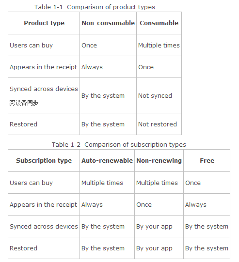

# Designing Your App’s Products
A product is something you want to sell in your app’s store. You create and configure products in iTunes Connect, and your app interacts with products using the SKProduct and SKProductsRequest classes.

产品是你想要在应用商店里出售的东西。 你在 iTunes Connect 里创建和配置产品，然后你的应用程序使用 SKProduct  和 SKProctsRequest 类跟产品交互。

## Understanding What You Can Sell Using In-App Purchase

一、了解什么产品你可以使用内置购买出售

You can use In-App Purchase to sell content, app functionality, and services.

你可以使用内置购买出售内容，应用功能和服务。

- Content. Deliver digital content or assets, such as magazines, photos, and artwork. Content can also be used by the app itself—for example, additional characters and levels in a game, filters in a camera app, and stationery in a word processor.

内容。传递数字内容或资产,比如杂志，相片和艺术品。 内容还可以被应用自己使用--比如，游戏中额外的角色和关卡，一个照相机应用的滤镜以及一个文本处理器的文具(stationery)。

- App functionality. Unlock behavior and expand features you’ve already delivered. Examples include a free game that offers multiplayer mode as an in-app purchase and a free weather app that lets users make a one-time purchase to remove ads.

应用功能。解锁你已经传递的行为和扩展功能。 比如一个免费游戏中提供一个多人模式作为一个内置购买产品，以及一个免费的天气应用提供一个内置购买让用户移除广告。

- Services. Have users pay for one-time services such as voice transcription and for ongoing services such as access to a collection of data.

服务。用户支付一次性服务比如声音的转录，用户支付长期服务比如访问一个数据集。

You can’t use In-App Purchase to sell real-world goods and services or to sell unsuitable content.

你不能用内置购买出售真实世界物品和服务或者出售不恰当的内容。

- Real-world goods and services. You must deliver a digital good or service within your app when using In-App Purchase. Use a different payment mechanism to let your users buy real-world goods and services in your app, such as a credit card or payment service.

真实世界物品和服务。当你使用内置购买时，你必须在应用程序里传递一个数字物品或服务。 使用一个不同的支付机制让你的用户在应用中购买真实世界物品和服务，比如信用卡或支付服务。

- Unsuitable content. Don’t use In-App Purchase to sell content that the isn’t allowed by the App Review Guidelines—for example, pornography, hate speech, or defamation.

不恰当的内容。 不要使用内置购买来出售应用程序审核标准禁止的内容---比如，色情，仇恨言论或者诽谤。

For detailed information about what you can offer using In-App Purchase, see [your license agreement and the App Review Guidelines](https://developer.apple.com/appstore/guidelines.html). Reviewing the guidelines carefully before you start coding helps you avoid delays and rejection during the review process. If the guidelines don’t address your case in sufficient detail, you can ask the App Review team specific questions using the [online contact form](https://developer.apple.com/appstore/contact/).

更多关于使用内置购买可以提供的内容，请看 [your license agreement and the App Review Guidelines](https://developer.apple.com/appstore/guidelines.html). 在开始编码之前仔细阅读审核指南可以帮你免除审核过程中德延迟和拒绝。 如果指南不涉及你需要的细节，你可以使用 [online contact form](https://developer.apple.com/appstore/contact/) 询问应用审核团队特定的问题。

After you know what products you want to sell in your app and determine that In-App Purchase is the appropriate way to sell those products, you need to create the products in iTunes Connect.

当你知道你想要在应用程序中出售什么并确定内置购买时出售那些产品的恰当方式后，你需要在 iTunes Connect 中创建产品。

##  Creating Products in iTunes Connect

二、在 iTunes Connect 中创建产品

Before you start coding, you need to configure products in iTunes Connect for your app to interact with. As you develop your app, you can add and remove products and refine or reconfigure your existing products.

在开始编码之前，你需要在 iTunes Connect 中为你的应用程序配置与之交互的产品。 当你开发应用程序时，你可以添加和删除产品以及改进或重新配置你现有的产品。

Every product is associated with a specific app. Products created for use by one app are not available in other apps. Companion apps on a different platform are different apps—the products of the Mac app are not available in the iOS app and vice versa.

每个产品都跟一个特定的应用程序相关联。 一个产品只对应一个应用程序，它不能被别的应用程序使用。在不同平台上的兄弟应用是不同的应用程序--Mac应用程序的产品在 iOS 等中是无法工作的。

Products are reviewed when you submit your app as part of the app review process. Before users can buy a product, it must be approved by the reviewer and you must mark it as “cleared for sale” in iTunes Connect.

当你递交应用时，产品会作为应用审核的一部分进行审核。 在用户可以购买一个产品之前，它必须通过审核并在 iTunes Connect 中标记为“cleared for sale”。

For step-be-step information about working with products in iTunes Connect, [In-App Purchase Configuration Guide for iTunes Connect](https://developer.apple.com/library/ios/documentation/LanguagesUtilities/Conceptual/iTunesConnectInAppPurchase_Guide/Chapters/Introduction.html#//apple_ref/doc/uid/TP40013727).

关于跟 iTunes Connect 中产品合作的更多信息，请看[In-App Purchase Configuration Guide for iTunes Connect](https://developer.apple.com/library/ios/documentation/LanguagesUtilities/Conceptual/iTunesConnectInAppPurchase_Guide/Chapters/Introduction.html#//apple_ref/doc/uid/TP40013727).

## Product Types

三、产品类型

Product types let you use In-App Purchase in a range of apps by providing several different product behaviors. In iTunes Connect, you select one of the following product types:

产品类型通过提供一些不同的产品行为，让你在特定的应用程序范围内使用内置购买。 在 iTunes Connect 中，你可以选择以下产品类型：

- Consumable products. Items that get used up over the course of running your app. Examples include minutes for a Voice over IP app and one-time services such as voice transcription.

耗材产品。应用程序运行过程中会耗尽的产品。 比如，包括一个几分钟的 IP 语音应用和一次性服务比如录音。

- Non-consumable products. Items that remain available to the user indefinitely on all of the user’s devices. They’re made available to all of the user’s devices. Examples include content, such as books and game levels, and additional app functionality.

非耗材产品。 所有用户设备上都能一直保持可用状态的产品。它们对于用户的所有设备都一样可用。例子包括内容，比如书和游戏关卡，以及更多地应用功能。

- Auto-renewable subscriptions. Episodic content. Like non-consumable products, auto-renewable subscriptions remain available to the user indefinitely on all of the user’s devices. Unlike non-consumable products, auto-renewable subscriptions have an expiration date. You deliver new content regularly, and users get access to content published during the time period their subscription is active. When an auto-renewable subscription is about to expire, the system automatically renews it on the user’s behalf.

 自动再生订阅。 章节内容， 就像非耗材产品，自动再生订阅在用户设备上也是永久可用。不同于非耗材产品的是，自动再生订阅它有过期时间。 你定期传递新的内容，用户在它们的订阅有效期间可以访问出版的内容。当一个自动再生订阅就要到期时，系统自动以用户的名义续订它。

- Non-renewable subscriptions. Subscriptions that don’t involve delivering episodic content. Examples include access to a database of historic photos or a collection of flight maps. It’s your app’s responsibility to make the subscription available on all of the user’s devices and to let users restore the purchase. This product type is often used when your users already have an account on your server that you can use to identify them when restoring content. Expiration and the duration of the subscription are also left to your app (or your server) to implement and enforce.

非再生订阅。 不涉及传递章节内容的订阅。例子包括访问一个历史照片的数据库或者一个航班表。 你有责任让订阅在所有用户的设备都可用，并且让用户恢复购买。 该产品类型通常在用户已经在你的服务器上有一个账号，你可以在用户恢复内容时用它认证他们。 到期和认购时间也保留在你的应用(或服务器)中以供实现和执行。

- Free subscriptions. A way to put free subscription content in Newsstand. After a user signs up for a free subscription, the content is available on all devices associated with the user’s Apple ID. Free subscriptions don’t expire and can be offered only in Newsstand-enabled apps.

免费订阅。 一种在报刊杂志中投放免费订阅的方法。 当用户注册了一个免费订阅后，订阅内容在用户的 Apple ID 相关的所有设备中都是可用的。 免费订阅不会到期，只能在开启报刊杂志的应用中提供。

## Differences Between Product Types
四、产品类型之间的区别
Each product type is designed for a particular use. The behavior of different product types varies in certain ways, as summarized in Table 1-1 and Table 1-2.

每个产品类型被设计用于特定用途。不同产品类型的行为在特定方式中会发生变化，如表格1-1，1-2中所述。

Products that expire or get used up—consumable products, auto-renewable subscriptions, and non-renewing subscriptions—can be purchased multiple times to get the consumable item again or extend the subscription. Non-consumable products and free subscriptions unlock content that remains available to the user indefinitely, so these can only be purchased once.

到期或耗尽产品--耗材产品，自动再生订阅以及非再生订阅--可以多次购买以再次获取耗材产品或者续订。 非耗材产品和免费订阅会永久的让产品保持有用，所以它们只需购买一次。

Consumable products and non-renewing subscriptions appear in the receipt after being purchased but are removed the next time the receipt is updated, as discussed in more detail in [ “Persisting Using the App Receipt.”](https://developer.apple.com/library/ios/documentation/NetworkingInternet/Conceptual/StoreKitGuide/Chapters/DeliverProduct.html#//apple_ref/doc/uid/TP40008267-CH5-SW16) All other types of products have an entry in the receipt that isn’t removed.

耗材产品和非再生订阅在购买了之后在 receipt 那出现，但是它们将在 receipt 下次更新时被删除，更多详情请看 [ “Persisting Using the App Receipt.”](https://developer.apple.com/library/ios/documentation/NetworkingInternet/Conceptual/StoreKitGuide/Chapters/DeliverProduct.html#//apple_ref/doc/uid/TP40008267-CH5-SW16)  剩余产品类型在 receipt 那都有一个条目(entry)并且不会被删除。

Consumable products, by their nature, aren’t synced or restored. Users understand that, for example, buying ten more bubbles on their iPhone doesn’t also give them ten more bubbles on their iPad. All other types of products are made available across all of the user’s devices. They’re also restored so users can continue to access their purchased content even after buying a new device. Store Kit handles the syncing and restoring process for auto-renewable and free subscriptions and for non-consumable products.

耗材产品，通常不同步或不能恢复。就是说，在 iPhone 上购买了10个气球，并不表示 iPad 也得给它们10个气球。所有其它产品类型都可以跨平台使用。 它们还可以恢复，所以用户可以继续访问它们购买的内容，即使它换了一个新设备。 商店 Kit 处理同步，为自动再生，免费订阅和非耗材产品处理恢复。 

Non-renewing subscriptions differ from auto-renewable subscriptions in a few key ways. These differences give your app the flexibility to implement the correct behavior for your needs, as follows:

非再生订阅与自动再生订阅在一些关键方法上有所不同。这些不同让你的应用可以灵活地根据需要实现正确的行为，如下：

- Your app is responsible for calculating the time period that the subscription is active and determining what content needs to be made available to the user.

应用程序负责计算订阅有效的时间并且决定什么内容需要开放给用户。

- Your app is responsible for detecting that a subscription is approaching its expiration date and prompting the user to renew the subscription by purchasing the product again.

应用程序负责侦测订阅即将到期，提醒用户再次购买产品来更新订阅。

- Your app is responsible for making subscriptions available across all the user’s devices after they’re purchased and for letting users restore past purchases. For example, most subscriptions are provided by a server; your server would need some mechanism to identify users and associate subscription purchases with the user who purchased them.

应用程序负责用户购买成功后让订阅能够跨平台使用，并且让用户恢复过去的购买记录。 比如，大多数订阅都有一个服务器提供；你得服务器将需要一些机制来认证用户并把购买的订阅跟用户关联到一起。