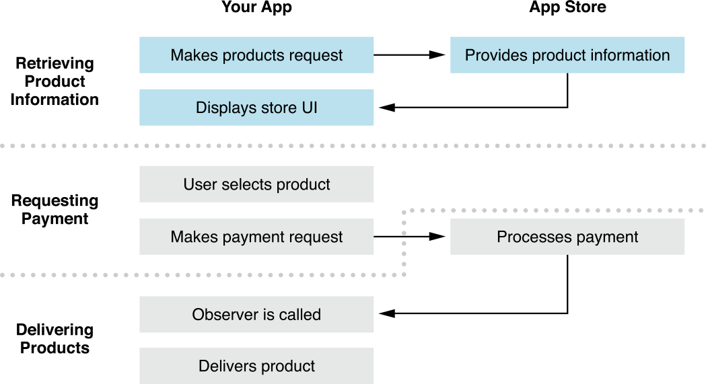
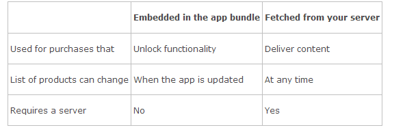

# Retrieving Product Information
In the first part of the purchase process, your app retrieves information about its products from the App Store, presents its store UI to the user, and then lets the user select a product, as shown in Figure 2-1.

首先，购买产品时，你的应用程序从应用商店获取该产品的信息，把商店 UI 提供给用户，然后让用户选择一个产品，如下图：

Figure 2-1  Stages of the purchase process—displaying store UI


## Getting a List of Product Identifiers

一、获取一个产品识别码列表

Every product you sell in your app has a unique product identifier. Your app uses these product identifiers to fetch information about products from the App Store, such as pricing, and to submit payment requests when users purchase those products. Your app can either read its list of product identifiers from a file in its app bundle or fetch them from your server. Table 2-1 summarizes the differences between the two approaches.

你在应用程序中出售的每个产品都有一个唯一的产品识别码。 应用程序使用这些产品识别码到应用商店获取产品信息，比如价格，并在用户购买这些产品时提交支付请求。 应用程序既可以从它的应用束(bundle)的一个文件中读取该产品识别码列表，也可以从你的服务器获取它们。表2-1 描述了这两种方法的区别：

Table 2-1  Comparison of approaches for obtaining product identifiers


If your app has a fixed list of products, such as an in-app purchase to remove ads or enable functionality, embed the list in the app bundle. If the list of product identifiers can change without your app needing to be updated, such as a game that supports additional levels or characters, have your app fetch the list from your server.

如果你的应用程序有一个固定的产品列表，比如一个内置购买来移除广告或开启功能，就 把列表整合到应用束内。 如果产品识别码列表不需要应用程序更新就可以做改变，比如一个支持额外关卡或角色的游戏，可以从你的服务器获取列表。

There’s no runtime mechanism to fetch a list of all products configured in iTunes Connect for a particular app. You’re responsible for managing your app’s list of products and providing that information to your app. If you need to manage a large number of products, consider using the bulk XML upload/download feature in iTunes Connect.

没有运行机制可以为一个特殊的应用获取 iTunes Connect 中所有的产品列表。你需要负责管理你的应用程序产品列表并提供该信息给你的应用程序。如果你需要管理大量的产品，建议使用 iTunes Connect 中得 bulk XML 上传下载功能。

##   Embedding Product IDs in the App Bundle
1、在应用束中整合产品 IDs

Include a property list file in your app bundle containing an array of product identifiers, such as the following:

在你的应用束中包含了一个特性列表文件，它包括了一个产品识别码数组。如下：

```
<?xml version="1.0" encoding="UTF-8"?>
<!DOCTYPE plist PUBLIC "-//Apple//DTD PLIST 1.0//EN"
 "http://www.apple.com/DTDs/PropertyList-1.0.dtd">
<plist version="1.0">
<array>
    <string>com.example.level1</string>
    <string>com.example.level2</string>
    <string>com.example.rocket_car</string>
</array>
</plist>
```

To get product identifiers from the property list, locate the file in the app bundle and read it.

要想从 plist 文件中获取产品识别码，在应用束中找到该文件并读取它。

```
NSURL *url = [[NSBundle mainBundle] URLForResource:@"product_ids"
                                     withExtension:@"plist"];
NSArray *productIdentifiers = [NSArray arrayWithContentsOfURL:url];
```

Fetching Product IDs from Your Server

2、从服务器获取产品 IDs

Host a JSON file on your server with the product identifiers. For example:

上传一个 JSON 文件到你的服务器，文件里带有产品识别码：如下：
```
[
    "com.example.level1",
    "com.example.level2",
    "com.example.rocket_car"
]
```
To get product identifiers from your server, fetch and read the JSON file as shown in Listing 2-1. Consider versioning the JSON file so that future versions of your app can change its structure without breaking older versions of your app. For example, you could name the file that uses the old structure products_v1.jsonand the file that uses a new structure products_v2.json. This is especially useful if your JSON file is more complex than the simple array in the example.

要想从服务器获取产品识别码，如列表2-1所示获取并读取该 JSON 文件。 考虑 JSON 文件的版本化，这样应用程序的未来版本就可以随时改变它的结构，而不需要打破应用程序的老版本。比如，你可以把使用老结构的产品命名为_v1.json, 把使用新结构的文件命名为_v2.json. 如果你的 JSON 文件比示例中的简单数组更复杂时，版本化方法更加有用。

Listing 2-1  Fetching product identifiers from your server

```
- (void)fetchProductIdentifiersFromURL:(NSURL *)url delegate:(id)delegate
{
    dispatch_queue_t global_queue =
           dispatch_get_global_queue(DISPATCH_QUEUE_PRIORITY_DEFAULT, 0);
    dispatch_async(global_queue, ^{
        NSError *err;
        NSData *jsonData = [NSData dataWithContentsOfURL:url
                                                  options:NULL
                                                    error:&err];
        if (!jsonData) { /* Handle the error */ }
 
        NSArray *productIdentifiers = [NSJSONSerialization
            JSONObjectWithData:jsonData options:NULL error:&err];
        if (!productIdentifiers) { /* Handle the error */ }
 
        dispatch_queue_t main_queue = dispatch_get_main_queue();
        dispatch_async(main_queue, ^{
           [delegate displayProducts:productIdentifiers]; // Custom method
        });
    });
}
```

For information about downloading files using [NSURLConnection](https://developer.apple.com/library/ios/documentation/Cocoa/Reference/Foundation/Classes/NSURLConnection_Class/Reference/Reference.html#//apple_ref/occ/cl/NSURLConnection), see [“Using NSURLConnection”](https://developer.apple.com/library/ios/documentation/Cocoa/Conceptual/URLLoadingSystem/Tasks/UsingNSURLConnection.html#//apple_ref/doc/uid/20001836) in[ URL Loading System Programming Guide](https://developer.apple.com/library/ios/documentation/Cocoa/Conceptual/URLLoadingSystem/URLLoadingSystem.html#//apple_ref/doc/uid/10000165i).

更多关于使用 [NSURLConnection](https://developer.apple.com/library/ios/documentation/Cocoa/Reference/Foundation/Classes/NSURLConnection_Class/Reference/Reference.html#//apple_ref/occ/cl/NSURLConnection) 下载文件的信息，请看  [“Using NSURLConnection”](https://developer.apple.com/library/ios/documentation/Cocoa/Conceptual/URLLoadingSystem/Tasks/UsingNSURLConnection.html#//apple_ref/doc/uid/20001836) in [ URL Loading System Programming Guide](https://developer.apple.com/library/ios/documentation/Cocoa/Conceptual/URLLoadingSystem/URLLoadingSystem.html#//apple_ref/doc/uid/10000165i).

To ensure that your app remains responsive, use a background thread to download the JSON file and extract the list of product identifiers. To minimize the data transferred, use standard HTTP caching mechanisms, such as the Last-Modified and If-Modified-Since headers.

为了确保你的应用程序保持响应，使用一个后台线程来下载 JSON 文件，并提取产品识别码列表。 要想最小化数据转换，使用标准的HTTP缓存机制，比如 Last-Modified 和  If-Modified-Since 头。

## Retrieving Product Information
二、取回产品信息

To make sure your users see only products that are actually available for purchase, query the App Store before displaying your app’s store UI.

为了确保你的用户只看到真实可买的产品，在显示应用的商店 UI 之前查询应用商店。

Use a products request object to query the App Store. First, create an instance of [SKProductsRequest](https://developer.apple.com/library/ios/documentation/StoreKit/Reference/SKProductsRequest/Reference/Reference.html#//apple_ref/occ/cl/SKProductsRequest) and initialize it with a list of product identifiers. The products request retrieves information about valid products, along with a list of the invalid product identifiers, and then calls its delegate to process the result. The delegate must implement the [SKProductsRequestDelegate](https://developer.apple.com/library/ios/documentation/StoreKit/Reference/SKProductsRequest/Reference/Reference.html#//apple_ref/occ/cl/SKProductsRequest) protocol to handle the response from the App Store. Listing 2-2 shows a simple implementation of both pieces of code.

使用一个产品请求对象来查询应用商店。首先，创建一个 [SKProductsRequest](https://developer.apple.com/library/ios/documentation/StoreKit/Reference/SKProductsRequest/Reference/Reference.html#//apple_ref/occ/cl/SKProductsRequest) 实例，并用产品识别码列表初始化它。 产品请求取回有效产品的信息，以及一个有效产品识别码列表，然后调用它的委托来处理结果。 委托必须实现   [SKProductsRequestDelegate](https://developer.apple.com/library/ios/documentation/StoreKit/Reference/SKProductsRequestDelegate/Reference/Reference.html#//apple_ref/occ/intf/SKProductsRequestDelegate)  协议来处理从应用商店的响应。列表2-2现实了一个两段代码的简单实现。

Listing 2-2  Retrieving product information

```
// Custom method
- (void)validateProductIdentifiers:(NSArray *)productIdentifiers
{
    SKProductsRequest *productsRequest = [[SKProductsRequest alloc]
        initWithProductIdentifiers:[NSSet setWithArray:productIdentifiers]];
    productsRequest.delegate = self;
    [productsRequest start];
}
 
// SKProductsRequestDelegate protocol method
- (void)productsRequest:(SKProductsRequest *)request
     didReceiveResponse:(SKProductsResponse *)response
{
    self.products = response.products;
 
    for (NSString *invalidIdentifier in response.invalidProductIdentifiers) {
        // Handle any invalid product identifiers.
    }
 
    [self displayStoreUI]; // Custom method
}
```

When the user purchases a product, you need the corresponding product object to create a payment request, so keep a reference to the array of product objects that’s returned to the delegate. If the list of products your app sells can change, you may want to create a custom class that encapsulates a reference to the product object as well as other information—for example, pictures or description text that you fetch from your server. Payment requests are discussed in[“Requesting Payment.”](https://developer.apple.com/library/ios/documentation/NetworkingInternet/Conceptual/StoreKitGuide/Chapters/RequestPayment.html#//apple_ref/doc/uid/TP40008267-CH4-SW2)

当用户购买一个产品时，你需要给该产品对象提供一个支付请求，因此保留一个到产品对象数组的引用，该数组会被返回给委托。 如果你的应用出售的产品列表能改变，你或许想要创建一个自定义类来把一个引用和其它信息一起封装到产品对象中---比如， 图片或你从服务器获取的描述文本。 支付请求在[“Requesting Payment.”](https://developer.apple.com/library/ios/documentation/NetworkingInternet/Conceptual/StoreKitGuide/Chapters/RequestPayment.html#//apple_ref/doc/uid/TP40008267-CH4-SW2) 中讨论。

Product identifiers being returned as invalid usually indicates an error in your app’s list of product identifiers, although it could mean the product hasn’t been properly configured in iTunes Connect. Good logging and a good UI help you resolve this type of issue more easily. In production builds, your app needs to fail gracefully—typically, this means displaying the rest of your app’s store UI and omitting the invalid product. In development builds, display an error to call attention to the issue. In both production and development builds, use [NSLog](https://developer.apple.com/library/ios/documentation/Cocoa/Reference/Foundation/Miscellaneous/Foundation_Functions/Reference/reference.html#//apple_ref/c/func/NSLog) to write a message to the console so you have a record of the invalid identifier. If your app fetched the list from your server, you could also define a logging mechanism to let your app send the list of invalid identifiers back to your server.

返回的无效产品识别码通常表明应用产品识别码列表中发生了一个 error， 尽管它或许意味着该产品在 iTunes Connect 中没有被正确配置。良好的日志(logging)和一个好的 UI 可以帮你更简单地解决该类型的问题。 在产品构建中，你的应用需要优雅地失败---通常，这意味着显示剩余的应用 UI 以及忽略无效产品。 在开发构建中，显示一个 error 来引起对该问题的关注。在产品和开发构建中，都使用 [NSLog](https://developer.apple.com/library/ios/documentation/Cocoa/Reference/Foundation/Miscellaneous/Foundation_Functions/Reference/reference.html#//apple_ref/c/func/NSLog)  来编写一个消息(message)来解决，这样你就有一个无效识别码的记录。 如果你的应用从服务器获取列表，你或许还要定义一个日志机制来让你的应用程序把无效识别码发送回服务器。

## Presenting Your App’s Store UI
三、呈现你的应用商店UI

Because the design of your app’s store has an important impact on your in-app sales, it’s worth investing the time and effort to get it right. Design the user interface for your store UI so it integrates with the rest of your app. Store Kit can’t provide a store UI for you. Only you know your app and its content well enough to design your store UI in a way that showcases your products in their best light and fits seamlessly with the rest of your app.

因为你的应用的商店设计对你的内置销售有很重要的影响，因此它值得投入时间和精力让其顺利工作。 为你的商店 UI 设计用户界面让它与你的应用的剩余部分集成(integrates)。 商店 Kit 不能给你提供商店 UI。 只有充分了解你的应用和它的内容设计出来的商店 UI，才能以最佳方向展示你得产品并使它与你的应用无缝结合。

Consider the following guidelines as you design and implement your app’s store UI.

当你设计和实现应用商店的 UI 时，请考虑以下指南：

Display a store only if the user can make payments. To determine whether the user can make payments, call the [canMakePayments](https://developer.apple.com/library/ios/documentation/StoreKit/Reference/SKPaymentQueue_Class/Reference/Reference.html#//apple_ref/occ/clm/SKPaymentQueue/canMakePayments) class method of the[SKPaymentQueue](https://developer.apple.com/library/ios/documentation/StoreKit/Reference/SKPaymentQueue_Class/Reference/Reference.html#//apple_ref/occ/cl/SKPaymentQueue) class. If the user can’t make payments (for example, because of parental restrictions), either display UI indicating that that the store isn’t available or omit the store portion of your UI entirely.

1.只在用户可以支付时显示一个商店。 调用 [SKPaymentQueue](https://developer.apple.com/library/ios/documentation/StoreKit/Reference/SKPaymentQueue_Class/Reference/Reference.html#//apple_ref/occ/cl/SKPaymentQueue)  类 的[canMakePayments](https://developer.apple.com/library/ios/documentation/StoreKit/Reference/SKPaymentQueue_Class/Reference/Reference.html#//apple_ref/occ/clm/SKPaymentQueue/canMakePayments) 方法来确认用户是否可以支付。 如果用户不能支付(比如，父母限制), 可以显示 UI 表明一个商店不可用，或者完全忽略商店部分。

Present products naturally in the flow of your app. Find the best place in your UI to show your app’s store UI. Present products in context at the time when the user can use them—for example, let users unlock functionality when they try to use that premium feature. Pay special attention to the experience a user has when exploring your app for the first time.

2.在你的应用流(flow)中自然地呈现产品。 在你的UI找到最好的位置来显示你的应用商店 UI。 在用户可以使用它们的时候呈现产品---比如，当用户尝试使用高级功能时让用户解锁该功能。 特别关注用户第一次使用你的应用时的用户体验。

Organize products so that exploration is easy and enjoyable. If your app has a small enough number of products, you can display everything on one screen; otherwise, group or categorize products to make them easy to navigate. Apps with a large number of products, such as comic book readers or magazines with many issues, benefit especially from an interface that makes it easy for users to discover new items they want to purchase. Make the differences between your products clear by giving them distinct names and visuals—if necessary, include explicit comparisons.

3.组织产品，这样探索就变得既简单又愉快。 如果你的应用只有一点产品，你可以在一个屏幕上显示所有产品；否则就把产品分组或分类让用户可以容易找到。 带有大数量产品的应用，比如，漫画书或者有很多报道的杂志，制作一个可以让用户简单地发现它们想要购买的新产品会特别有用。 给你的产品一个不同的名字和视觉效果，明确地区分它们--如有需要，包括明确地比较。

Communicate the value of your products to your users. Users want to know exactly what they’re going to buy. Combine information from the App Store, such as product prices and descriptions, with additional data from your server or the app bundle, such as images or demos of your products. Let users interact with a product in a limited way before buying it. For example, a game that gives the user the option to buy new race cars can allow users to run a test lap with the new car. Likewise, a drawing app that lets the user buy additional brushes can give users the chance to draw with the new brush on a small scratch pad and see the difference between brushes. This kind of design provides users an opportunity to experience the product and be convinced they want to purchase it.

4、向用户交流你的产品的价值。 用户想要准确地知道他们即将要买什么。 综合应用商店的信息，比如产品价格和描述，和服务器或应用束中的附加数据，比如，产品的图片或 demos。 让用户在购买之前以一种限制的方式体现产品。 举个例子，有一个游戏，让用户选择购买新赛车(race cars)可以让用户用新车试跑一圈。 又或者，一个绘图应用，让用户购买一个额外的笔刷可以让用户用新笔刷在一个小便签上绘图，让它查看笔刷之间的区别。 这类的设计给用户提供了一个体验产品的机会并说服它们购买。

Display prices clearly, using the locale and currency returned by the App Store. Ensure that the price of a product is easy to find and easy to read. Don’t try to convert the price to a different currency in your UI, even if the user’s locale and the price’s locale differ. Consider, for example, a user in the United States who prefers the United Kingdom locale for its units and date formatting. Your app displays its UI according to the United Kingdom locale, but it still needs to display product information in the locale specified by the App Store. Converting prices to British pounds sterling, in an attempt to match the United Kingdom locale of the rest of the interface, would be incorrect. The user has an App Store account in the United States and pays in U.S. dollars, so prices would be provided to your app in U.S. dollars. Likewise, your app would display its prices in U.S. dollars. Listing 2-3 shows how to correctly format a price by using the product’s locale information.

5、使用应用商店返回的语言环境(locale)和货币清楚地显示价格。 确保能简单找到产品的价格并能简单地识别。 不要尝试在你的 UI 中把价格转换为一个不同的货币，即使用户的语言环境和价格的语言环境不一样。 想想看，一个在美国的用户因为它的单位和日期格式更喜欢英国的语言环境。 你的应用根据英国的语言环境显示它的 UI，但它任然需要用应用商店指定的语言环境显示产品信息。 为了尝试匹配余下界面的英国语言环境，把价格转换为英国英镑是不正确的。 用户在美国有一个应用商店账号，它用美元支付，因此会给你的应用提供一个以美元为单位的价格。还有，你得应用将以美元为单元显示价格。列表2-3 显示了如何通过使用产品的语言环境信息来正确设置价格单位。

Listing 2-3  Formatting a product’s price

```
NSNumberFormatter *numberFormatter = [[NSNumberFormatter alloc] init];
[numberFormatter setFormatterBehavior:NSNumberFormatterBehavior10_4];
[numberFormatter setNumberStyle:NSNumberFormatterCurrencyStyle];
[numberFormatter setLocale:product.priceLocale];
NSString *formattedPrice = [numberFormatter stringFromNumber:product.price];
```

After a user selects a product to buy, your app connects to the App Store to request payment for the product.

当用户选择好要购买的产品后，你的应用连接到应用商店请求为该产品提供支付。


## Suggested Testing Steps
四、建议测试步骤

Test each part of your code to verify that you’ve implemented it correctly.

测试代码的每个部分来认证你已经正确地实现了该功能。

### Sign In to the App Store with Your Test Account
1、用你的测试账号登入应用商店

Create a test user account in iTunes Connect, as described in “Creating Test User Accounts” in  *[iTunes Connect Developer Guide](https://developer.apple.com/library/ios/documentation/LanguagesUtilities/Conceptual/iTunesConnect_Guide/Chapters/About.html#//apple_ref/doc/uid/TP40011225)*.

在 iTunes Connect 里创建一个测试账号，请看  *[iTunes Connect Developer Guide](https://developer.apple.com/library/ios/documentation/LanguagesUtilities/Conceptual/iTunesConnect_Guide/Chapters/About.html#//apple_ref/doc/uid/TP40011225)*. 的“Creating Test User Accounts” 。

On a development iOS device, sign out of the App Store in Settings. Then build and run your app from Xcode.

在一个 iOS 开发设备中，在设置中退出应用商店。然后从 Xcode 构建和运行你的应用。

On a development OS X device, sign out of the Mac App Store. Then build your app in Xcode and launch it from the Finder.

在一个 OS X 开发设备中，退出 Mac 应用商店。 然后在 Xcode 中构建你的应用，并从 Finder 中运行它。

Use your app to make an in-app purchase. When prompted to sign in to the App Store, use your test account. Note that the text “[Environment: Sandbox]” appears as part of the prompt, indicating that you’re connected to the test environment.

使用你的应该来完成一个内置购买。当提示你登陆应用商店时，使用你的测试账号。 注意提示框中出现的[Environment: Sandbox]文字提示你目前连接到测试环境。

If the text “[Environment: Sandbox]” doesn’t appear, you’re using the production environment. Make sure you’re running a development-signed build of your app. Production-signed builds use the production environment.

如果[Environment: Sandbox] 没有出现，则表示你使用的是产品环境。 确保你的应用运行在一个开发签署(development-signed)构建。签署的产品构建使用产品环境。
Important: Don’t use your test user account to sign in to the production environment. If you do, the test user account becomes invalid and can no longer be used.

重要提示：不要用你的测试用户账号登陆产品环境，否则测试用户账号将无效不能再使用。

### Test Fetching the List of Product Identifiers
2. 测试获取产品认证码列表

If your product identifiers are embedded in your app, set a breakpoint in your code after they’re loaded and verify that the instance of NSArray contains the expected list of product identifiers.

如果你的产品认证码被整合进应用程序，在它们加载后，在代码里设置一个断点，并认证包含了预期产品识别码列表的 NSArray 实例。

If your product identifiers are fetched from a server, manually fetch the JSON file—using a web browser such as Safari or a command-line utility such as curl—and verify that the data returned from your server contains the expected list of product identifiers. Also verify that your server correctly implements standard HTTP caching mechanisms.

如果你的产品识别码是从服务器中获取的，使用一个网络浏览器如 Safari 或一个命令行工具如 curl 来手工获取 JSON 文件，并认证从服务器返回的数据，该数据包含了预期的产品识别码列表。 同时还要认证你得服务器正确地实现了标准 HTTP 缓存机制。

###Test Handling of Invalid Product Identifiers

3、测试处理无效产品识别码

Intentionally include an invalid identifier in your app’s list of product identifiers. (Make sure you remove it after testing.)

在你的产品识别码列表中故意包含进一个无效识别码。（确保在测试成功后删除它）

In a production build, verify that the app displays the rest of its store UI and users can purchase other products. In a development build, verify that the app brings the issue to your attention.

在一个产品构建中，验证应用程序显示了其余的商店UI，用户可以购买其他的产品。 在一个开发构建中，验证应用程序中引起你关注的问题。

Check the console log and verify that you can correctly identify the invalid product identifier.

检查控制台日志并验证你可以正确地识别无效产品识别码。


###Test a Products Request

4、测试一个产品请求

Using the list of product identifiers that you tested, create and submit an instance of[SKProductsRequest ](https://developer.apple.com/library/ios/documentation/StoreKit/Reference/SKProductsRequest/Reference/Reference.html#//apple_ref/occ/cl/SKProductsRequest). Set a breakpoint in your code, and inspect the lists of valid and invalid product identifiers. If there are invalid product identifiers, review your products in iTunes Connect and correct your JSON file or property list.

使用你测试好的产品识别码列表，创建并递交一个[SKProductsRequest ](https://developer.apple.com/library/ios/documentation/StoreKit/Reference/SKProductsRequest/Reference/Reference.html#//apple_ref/occ/cl/SKProductsRequest)实例。 在你的代码中设置一个断点，检查有效和无效的产品识别码。 如果有无效产品识别码，检阅 iTunes Connect 中的产品并更正你的 JSON 文件或特性列表。