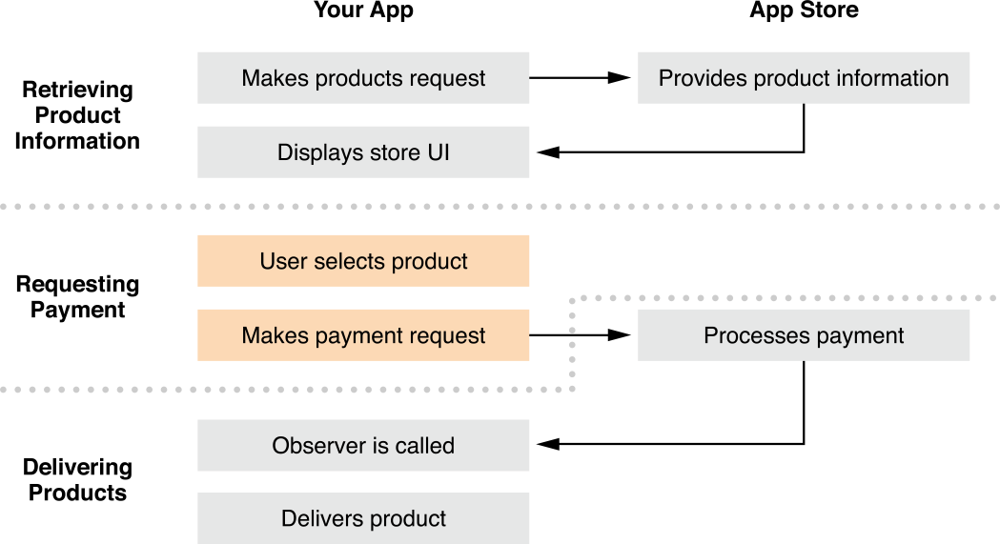

# Requesting Payment
In the second part of the purchase process, after the user has chosen to purchase a particular product, your app submits a payment request to the App Store, as shown in Figure 3-1.

购买过程的第二步是，在用户已经选择好要购买的产品后，你的应用程序向应用商店提交一个支付请求，如下图：

Figure 3-1  Stages of the purchase process—requesting payment

## Creating a Payment Request

一、创建一个支付请求

When the user selects a product to buy, create a payment request using a product object, and set the quantity if needed, as shown in Listing 3-1. The product object comes from the array of products returned by your app’s products request, as discussed in [“Retrieving Product Information.”](https://developer.apple.com/library/ios/documentation/NetworkingInternet/Conceptual/StoreKitGuide/Chapters/ShowUI.html#//apple_ref/doc/uid/TP40008267-CH3-SW9)

当用户选择了一个要买的产品后，使用一个产品对象创建一个支付请求，并根据需要设置好购买数量，如下列表。 正如[In-App Purchase----（三) ----Retrieving Product Information](http://www.cnblogs.com/patientAndPersist/p/3701978.html) 中所述，产品对象来自应用的 products requst 返回的数组。
Listing 3-1  Creating a payment request

```
SKProduct *product = <# Product returned by a products request #>;
SKMutablePayment *payment = [SKMutablePayment paymentWithProduct:product];
payment.quantity = 2;
```

## Detecting Irregular Activity

二、检测不规则活动

The App Store uses an irregular activity detection engine to help combat fraud. Some apps can provide additional information to improve the engine’s ability to detect unusual transactions. If your users have an account with you, in addition to their App Store accounts, provide this additional piece of information when requesting payment.

应用商店使用一个不规则活动检测引擎来帮助打击欺骗行为。 一个应用程序可以提供额外的信息来提高引擎的性能以便检测不正常的交易。 如果你的用户除了有自己的应用商店账号外，还有一个你的账号，就可以在请求支付时提供该额外的信息片段。

By way of illustration, consider the following two examples. In the normal case, many different users on your server each buy coins to use in your game, and each user pays for the purchase from a different App Store account. In contrast, it would be very unusual for a single user on your server to buy coins multiple times, paying for each purchase from a different App Store account. The App Store can’t detect this kind of irregular activity on its own—it needs information from your app about which account on your server is associated with the transaction.

通过演示的方法，考虑以下两个例子。 在正常情况下，你的服务器上的很多不同的用户购买游戏中金币(coins)，并且每个用户都从一个不同的应用商店账号购买。相反，如果同一个用户在你的服务器上多次购买金币，但是每次购买都从不同的应用商店账号上支付就非常不寻常。应用商店自己不能检测到该类型的不规则活动--它需要从你的应用程序中知道你服务器上的哪个账号跟该笔交易有关联。

To provide this information, populate the [applicationUsername](https://developer.apple.com/library/ios/documentation/StoreKit/Reference/SKPaymentRequest_Class/Reference/Reference.html#//apple_ref/occ/instp/SKPayment/applicationUsername) property of the payment object with a one-way hash of the user’s account name on your server, such as in the example shown in Listing 3-2.

要想提供该信息，用你服务器中的用户账号名称，以单向散列方式填写[applicationUsername](https://developer.apple.com/library/ios/documentation/StoreKit/Reference/SKPaymentRequest_Class/Reference/Reference.html#//apple_ref/occ/instp/SKPayment/applicationUsername)特性，如下：

Listing 3-2  Providing an application username

```
# import <CommonCrypto/CommonCrypto.h>
 
// Custom method to calculate the SHA-256 hash using Common Crypto
- (NSString *)hashedValueForAccountName:(NSString*)userAccountName
{
    const int HASH_SIZE = 32;
    unsigned char hashedChars[HASH_SIZE];
    const char *accountName = [userAccountName UTF8String];
    size_t accountNameLen = strlen(accountName);
 
    // Confirm that the length of the user name is small enough
    // to be recast when calling the hash function.
    if (accountNameLen > UINT32_MAX) {
        NSLog(@"Account name too long to hash: %@", userAccountName);
        return nil;
    }
    CC_SHA256(accountName, (CC_LONG)accountNameLen, hashedChars);
 
    // Convert the array of bytes into a string showing its hex representation.
    NSMutableString *userAccountHash = [[NSMutableString alloc] init];
    for (int i = 0; i < HASH_SIZE; i++) {
        // Add a dash every four bytes, for readability.
        if (i != 0 && i%4 == 0) {
            [userAccountHash appendString:@"-"];
        }
        [userAccountHash appendFormat:@"%02x", hashedChars[i]];
    }
 
    return userAccountHash;
}
```

If you use another approach to populate this property, ensure that the value you provide is an opaque identifier uniquely associated with the user’s account on your server. Don’t use the Apple ID for your developer account, the user’s Apple ID, or the user’s unhashed account name on your server.

如果你使用另一种方法填写该特性，请确保你提供的值是一个不透明的识别码，它只跟你服务器上的用户账号有关。 不要使用苹果 ID 作为你的开发者账号，用户的苹果 ID，或用户在你的服务器的非散列账户名。

## Submitting a Payment Request

三、递交一个支付请求

Adding a payment request to the transaction queue submits it the App Store. If you add a payment object to the queue multiple times, it’s submitted multiple times—the user is charged multiple times and your app is expected to deliver the product multiple times.

向要递交给应用商店的交易队列添加一个支付请求。 如果你多次把一个支付对象添加到队列，它就会被提交多次---用户就会被多次要求支付并且应用程序就回多次传递产品。

```
[[SKPaymentQueue defaultQueue] addPayment:payment];\
```

For every payment request your app submits, it gets back a corresponding transaction that it must process. Transactions and the transaction queue are discussed in [“Waiting for the App Store to Process Transactions.”](https://developer.apple.com/library/ios/documentation/NetworkingInternet/Conceptual/StoreKitGuide/Chapters/DeliverProduct.html#//apple_ref/doc/uid/TP40008267-CH5-SW4)

对于你的应用程序递交的每个支付请求，都会返回一个相应地交易，它必须处理它。 交易和交易队列在[“Waiting for the App Store to Process Transactions.”](https://developer.apple.com/library/ios/documentation/NetworkingInternet/Conceptual/StoreKitGuide/Chapters/DeliverProduct.html#//apple_ref/doc/uid/TP40008267-CH5-SW4)中讨论。