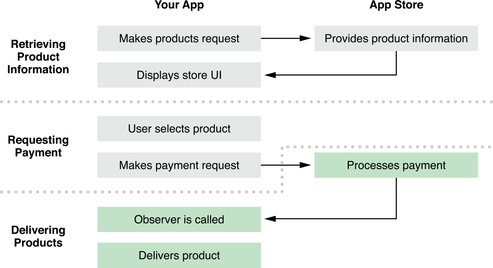
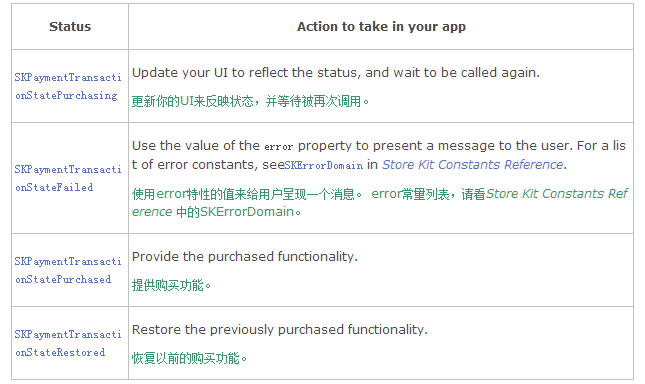

# Delivering Products
In the final part of the purchase process, your app waits for the App Store to process the payment request, stores information about the purchase for future launches, downloads the purchased content, and then marks the transaction as finished, as shown in Figure 4-1.

购买过程的最后一部分是你的应用程序等待应用商店处理支付请求，存储本次购买的信息以便将来启动，下载购买的内容，然后标记交易结束，如图4-1。

Figure 4-1  Stages of the purchase process—delivering products

## Waiting for the App Store to Process Transactions

一、等待应用商店处理交易

The transaction queue plays a central role in letting your app communicate with the App Store through the Store Kit framework. You add work to the queue that the App Store needs to act on, such as a payment request that needs to be processed. When the transaction’s state changes—for example, when a payment request succeeds—Store Kit calls the app’s transaction queue observer. It’s your decision which class acts as the observer. In very small apps, you could handle all the Store Kit logic in the app delegate, including observing the transaction queue. In most apps, you create a separate class that handles this observer logic along with the rest of your app’s store logic. The observer must conform to the [SKPaymentTransactionObserver](https://developer.apple.com/library/ios/documentation/StoreKit/Reference/SKPaymentTransactionObserver_Protocol/Reference/Reference.html#//apple_ref/occ/intf/SKPaymentTransactionObserver) protocol.

交易队列通过商店 Kit 框架在你的应用和应用商店的交流过程中起着核心作用。你把应用商店需要处理的工作添加到队列，比如一个需要被处理的支付请求。 当交易状态改变时---比如，当一个支付请求成功时---商店 Kit 调用应用的交易队列观察者(observer)。 你需要决定哪个类作为观察者(observer)。 在很少的应用中，你可以在应用委托中处理所有的商店 Kit 逻辑，包括观察交易队列。 在大多数应用中，你创建一个单独的类来处理该观察者逻辑和其余的应用程序商店逻辑。 观察者必须遵循 [SKPaymentTransactionObserver](https://developer.apple.com/library/ios/documentation/StoreKit/Reference/SKPaymentTransactionObserver_Protocol/Reference/Reference.html#//apple_ref/occ/intf/SKPaymentTransactionObserver) 协议。

Using an observer means your app doesn’t constantly poll the status of its active transactions. In addition to using the transaction queue for payment requests, your app also uses the transaction queue to download Apple-hosted content and to find out that subscriptions have been renewed.

使用一个观察者意味着应用程序不会不断地查询其活动交易的状态。 除了使用交易队列来处理支付请求，应用程序还使用它来下载苹果托管的内容并找出已经更新的订阅。

Register a transaction queue observer when your app is launched, as shown in Listing 4-1. Make sure that the observer is ready to handle a transaction at any time, not just after you add a transaction to the queue. For example, consider the case of a user buying something in your app right before going into a tunnel. Your app isn’t able to deliver the purchased content because there’s no network connection. The next time your app is launched, Store Kit calls your transaction queue observer again and delivers the purchased content at that time. Similarly, if your app fails to mark a transaction as finished, Store Kit calls the observer every time your app is launched until the transaction is properly finished.

当你的应用启动时注册一个交易队列，如列表4-1. 确保观察者已经随时准备好处理交易，而不只在你添加一个交易到队列后处理。 举个例子，考虑一个用户在他进入一个隧道(tunnel)之前正好在你的应用中购买了一些东西。 你的应用不能传递被购的内容，因为没有网络连接。当你的应用下次启动时，商店 Kit 再次调用你的交易队列观察者并在那时传递被购的内容。 类似地，如果你的应用程序标记结束一个交易失败，每次你的应用启动时，商店 Kit 都会调用观察者直到交易被正确地结束。

Listing 4-1  Registering the transaction queue observer
```

- (BOOL)application:(UIApplication *)application
 didFinishLaunchingWithOptions:(NSDictionary *)launchOptions
{
    /* ... */
 
    [[SKPaymentQueue defaultQueue] addTransactionObserver:observer];
}
```

Implement the [paymentQueue:updatedTransactions:](https://developer.apple.com/library/ios/documentation/StoreKit/Reference/SKPaymentTransactionObserver_Protocol/Reference/Reference.html#//apple_ref/occ/intfm/SKPaymentTransactionObserver/paymentQueue:updatedTransactions:) method on your transaction queue observer. Store Kit calls this method when the status of a transaction changes—for example, when a payment request has been processed. The transaction status tells you what action your app needs to perform, as shown in Table 4-1 and Listing 4-2. Transactions in the queue can change state in any order. Your app needs to be ready to work on any active transaction at any time.

在你的交易队列观察者中实现 [paymentQueue:updatedTransactions:](https://developer.apple.com/library/ios/documentation/StoreKit/Reference/SKPaymentTransactionObserver_Protocol/Reference/Reference.html#//apple_ref/occ/intfm/SKPaymentTransactionObserver/paymentQueue:updatedTransactions:) 方法。 交易状态改变时，商店 Kit 调用该方法--- 比如，当一个支付请求被处理时。 交易状态告诉你的应用该执行什么动作，如表 4-1 和列表 4-2. 队列中的交易可以以任何顺序改变状态。 你的应用需要准备好在任何时候处理任何活动交易。

Table 4-1  Transaction statuses and corresponding actions表 4-1 交易状态和相应的动作



Listing 4-2  Responding to transaction statuses

列表 4-2 相应交易状态

```
 (void)paymentQueue:(SKPaymentQueue *)queue
 updatedTransactions:(NSArray *)transactions
{
    for (SKPaymentTransaction *transaction in transactions) {
        switch (transaction.transactionState) {
            // Call the appropriate custom method.
            case SKPaymentTransactionStatePurchased:
                [self completeTransaction:transaction];
                break;
            case SKPaymentTransactionStateFailed:
                [self failedTransaction:transaction];
                break;
            case SKPaymentTransactionStateRestored:
                [self restoreTransaction:transaction];
            default:
                break;
        }
    }
}

```

To keep your user interface up to date while waiting, the transaction queue observer can implement optional methods from the [SKPaymentTransactionObserver](https://developer.apple.com/library/ios/documentation/StoreKit/Reference/SKPaymentTransactionObserver_Protocol/Reference/Reference.html#//apple_ref/occ/intf/SKPaymentTransactionObserver) protocol as follows. The [paymentQueue:removedTransactions](https://developer.apple.com/library/ios/documentation/StoreKit/Reference/SKPaymentTransactionObserver_Protocol/Reference/Reference.html#//apple_ref/occ/intfm/SKPaymentTransactionObserver/paymentQueue:removedTransactions:): method is called when transactions are removed from the queue—in your implementation of this method, remove the corresponding items from your app’s UI. The [paymentQueueRestoreCompletedTransactionsFinished](https://developer.apple.com/library/ios/documentation/StoreKit/Reference/SKPaymentTransactionObserver_Protocol/Reference/Reference.html#//apple_ref/occ/intfm/SKPaymentTransactionObserver/paymentQueueRestoreCompletedTransactionsFinished:): or [paymentQueue:restoreCompletedTransactionsFailedWithError](https://developer.apple.com/library/ios/documentation/StoreKit/Reference/SKPaymentTransactionObserver_Protocol/Reference/Reference.html#//apple_ref/occ/intfm/SKPaymentTransactionObserver/paymentQueue:restoreCompletedTransactionsFailedWithError:): method is called when Store Kit finishes restoring transactions, depending on whether there was an error. In your implementation of these methods, update your app’s UI to reflect the success or error.

为了在等待时保持用户界面最新，交易队列观察者可以实现[SKPaymentTransactionObserver](https://developer.apple.com/library/ios/documentation/StoreKit/Reference/SKPaymentTransactionObserver_Protocol/Reference/Reference.html#//apple_ref/occ/intf/SKPaymentTransactionObserver)  协议的以下可选方法：当交易被从队列中移除时，调用[paymentQueueRestoreCompletedTransactionsFinished](https://developer.apple.com/library/ios/documentation/StoreKit/Reference/SKPaymentTransactionObserver_Protocol/Reference/Reference.html#//apple_ref/occ/intfm/SKPaymentTransactionObserver/paymentQueueRestoreCompletedTransactionsFinished:): 方法--- 在该方法的实现中，从你的应用的 UI 移除相应的产品。 当商店 Kit 结束恢复交易时，根据是否有 error 发生调用[paymentQueueRestoreCompletedTransactionsFinished](https://developer.apple.com/library/ios/documentation/StoreKit/Reference/SKPaymentTransactionObserver_Protocol/Reference/Reference.html#//apple_ref/occ/intfm/SKPaymentTransactionObserver/paymentQueueRestoreCompletedTransactionsFinished:):  或 [paymentQueue:restoreCompletedTransactionsFailedWithError](https://developer.apple.com/library/ios/documentation/StoreKit/Reference/SKPaymentTransactionObserver_Protocol/Reference/Reference.html#//apple_ref/occ/intfm/SKPaymentTransactionObserver/paymentQueue:restoreCompletedTransactionsFailedWithError:): 方法。 在这些方法的实现中，更新你的应用的 UI 来反映成功或 error。

## Persisting the Purchase

二、保留购买记录

After making the product available, your app needs to make a persistent record of the purchase. Your app uses that persistent record on launch to continue to make the product available. It also uses that record to restore purchases, as described in [“Restoring Purchased Products.”](https://developer.apple.com/library/ios/documentation/NetworkingInternet/Conceptual/StoreKitGuide/Chapters/Restoring.html#//apple_ref/doc/uid/TP40008267-CH8-SW9) Your app’s persistence strategy depends the type of products you sell and the versions of iOS. 

产品有效之后，你的应用需要做购买的一个持久记录。 当启动时，你的应用使用该持久记录让产品变得有效。 它还使用该记录来恢复购买，正如[“Restoring Purchased Products.”](https://developer.apple.com/library/ios/documentation/NetworkingInternet/Conceptual/StoreKitGuide/Chapters/Restoring.html#//apple_ref/doc/uid/TP40008267-CH8-SW9)中所述。 你的应用的持久化策略取决于你出售的产品类型以及 iOS 的版本。

- For non-consumable products and auto-renewable subscriptions in iOS 7 and later, use the app receipt as your persistent record.

iOS 7 以及之后的版本，对于非耗材产品和自动再生订阅，使用应用收据作为你的持久记录。

- For non-consumable products and auto-renewable subscriptions in versions of iOS earlier than iOS 7, use the User Defaults system or iCloud to keep a persistent record.

iOS 7 之前的版本，对于非耗材产品和自动再生订阅，使用用户默认系统或 iCloud 来保留一个持久记录。

- For non-renewing subscriptions, use iCloud or your own server to keep a persistent record.

对于非再生订阅，使用 iCloud 或你自己的服务器来保留一个持久记录。

For consumable products, your app updates its internal state to reflect the purchase, but there’s no need to keep a persistent record because consumable products aren’t restored or synced across devices. Ensure that the updated state is part of an object that supports state preservation (in iOS) or that you manually preserve the state across app launches (in iOS or OS X). For information about state preservation, see [“State Preservation and Restoration”](https://developer.apple.com/library/ios/documentation/iPhone/Conceptual/iPhoneOSProgrammingGuide/StatePreservation/StatePreservation.html#//apple_ref/doc/uid/TP40007072-CH11) in [iOS App Programming Guide](https://developer.apple.com/library/ios/documentation/iPhone/Conceptual/iPhoneOSProgrammingGuide/Introduction/Introduction.html#//apple_ref/doc/uid/TP40007072).

对于耗材产品，你的应用更新它的内部状态来反映购买，但是没有必要保留一个持久记录因为耗材产品不能恢复或不能跨设备同步。 确保被更新状态是一个支持状态保留(in iOS)对象的一部分，或者是一个你手动保留整个应用启动状态的对象(in iOS 或者 OS X). 关于状态保留的信息，请看[iOS App Programming Guide](https://developer.apple.com/library/ios/documentation/iPhone/Conceptual/iPhoneOSProgrammingGuide/Introduction/Introduction.html#//apple_ref/doc/uid/TP40007072) 中的[“State Preservation and Restoration”](https://developer.apple.com/library/ios/documentation/iPhone/Conceptual/iPhoneOSProgrammingGuide/StatePreservation/StatePreservation.html#//apple_ref/doc/uid/TP40007072-CH11) 。 

When using the User Defaults system or iCloud, your app can store a value, such as a number or a Boolean, or a copy of the transaction receipt. In OS X, the user can edit the User Defaults system using the defaults command. Storing a receipt requires more application logic, but prevents the persistent record from being tampered with.

当你使用用户默认系统(User Defaults system)或 iCloud 时，你的应用可以存储一个值，可以时一个数字或布尔值，或者备份交易收据。 在 OS X 中，用户可以使用 defaults 命令编辑用户默认系统。 存储一个收据除了防止持久记录被篡改外，还要求更多的应用逻辑。

When persisting via iCloud, note that your app’s persistent record is synced across devices, but your app is responsible for downloading any associated content on other devices.

当你通过 iCloud 保留记录时，请注意应用程序的持久记录是夸设备同步的，但是在别的设备上也是有你的应用负责下载任何相关内容。

Persisting Using the App Receipt
1.使用应用收据来保留记录

The app receipt contains a record of the user’s purchases, cryptographically signed by Apple. For more information, see Receipt Validation Programming Guide.

应用记录包括了用户购买的一个记录，它由苹果公司加密签名。更多详情，请看 Receipt Validation Programming Guide.

Information about consumable products and non-renewing subscriptions is added to the receipt when they’re paid for and remains in the receipt until you finish the transaction. After you finish the transaction, this information is removed the next time the receipt is updated—for example, the next time the user makes a purchase.

关于耗材产品和无需更新订阅的产品信息在它们被支付后加入收据，并保留该信息直到你结束这个交易。 当你结束了这个交易后，该信息将被删除，下一次的收据被更新---比如，下次用户做个一个购买。

Information about all other kinds of purchases is added to the receipt when they’re paid for and remains in the receipt indefinitely.

所有其它类型的购买信息在它们被支付时加入收据，并且永久保留该收据。

## Persisting a Value in User Defaults or iCloud
2.在用户默认系统或 iCloud 中保留一个值

To store information in User Defaults or iCloud, set the value for a key.

要想在用户默认系统或 iCloud 中保留信息，把该值设置为一个关键字(key)。

```
#if USE_ICLOUD_STORAGE
NSUbiquitousKeyValueStore *storage = [NSUbiquitousKeyValueStore defaultStore];
#else
NSUserDefaults *storage = [NSUserDefaults standardUserDefaults];
#endif
 
[storage setBool:YES forKey:@"enable_rocket_car"];
[storage setObject:@15 forKey:@"highest_unlocked_level"];
 
[storage synchronize];
```

## Persisting a Receipt in User Defaults or iCloud
3. 在用户默认系统或 iCloud 中保留一个收据

To store a transaction’s receipt in User Defaults or iCloud, set the value for a key to the data of that receipt.

要想在用户默认系统或 iCloud 中存储一个交易收据，把值设置为一个关键字(key)赋值给收据。

```
#if USE_ICLOUD_STORAGE
NSUbiquitousKeyValueStore *storage = [NSUbiquitousKeyValueStore defaultStore];
#else
NSUserDefaults *storage = [NSUserDefaults standardUserDefaults];
#endif
 
NSData *newReceipt = transaction.transactionReceipt;
NSArray *savedReceipts = [storage arrayForKey:@"receipts"];
if (!receipts) {
    // Storing the first receipt
    [storage setObject:@[newReceipt] forKey:@"receipts"];
} else {
    // Adding another receipt
    NSArray *updatedReceipts = [savedReceipts arrayByAddingObject:newReceipt];
    [storage setObject:updatedReceipts forKey:@"receipts"];
}
 
[storage synchronize];
```

## Persisting a Receipt in User Defaults or iCloud
3.在用户默认系统或 iCloud 中保留一个收据

To store a transaction’s receipt in User Defaults or iCloud, set the value for a key to the data of that receipt.

要想在用户默认系统或 iCloud 中存储一个交易收据，把值设置为一个关键字(key)赋值给收据。

```
#if USE_ICLOUD_STORAGE
NSUbiquitousKeyValueStore *storage = [NSUbiquitousKeyValueStore defaultStore];
#else
NSUserDefaults *storage = [NSUserDefaults standardUserDefaults];
#endif
 
NSData *newReceipt = transaction.transactionReceipt;
NSArray *savedReceipts = [storage arrayForKey:@"receipts"];
if (!receipts) {
    // Storing the first receipt
    [storage setObject:@[newReceipt] forKey:@"receipts"];
} else {
    // Adding another receipt
    NSArray *updatedReceipts = [savedReceipts arrayByAddingObject:newReceipt];
    [storage setObject:updatedReceipts forKey:@"receipts"];
}
 
[storage synchronize];
```

Persisting Using Your Own Server
4. 用自己的服务器保留

Send a copy of the receipt to your server along with some kind of credentials or identifier so you can keep track of which receipts belong to a particular user. For example, let users identify themselves to your server with an email or user name, plus a password. Don’t use the identifierForVendor property of UIDevice—you can’t use it to identify and restore purchases made by the same user on a different device, because different devices have different values for this property.

把收据的副本和某些凭据和识别码一起发送到你的服务器，这样你可以随时查看某个用户的收据。 比如，让用户使用 email 或用户名密码登陆。不要使用 UIDevice 类的 identifierForVendor 特性---你不能用它来认证和恢复不同设备上同一用户的购买记录，因为不同的设备的该特性有不同的值。


## Unlocking App Functionality

三、解锁应用功能

If the product enables app functionality, set a Boolean value to enable the code path and update your user interface as needed. To determine what functionality to unlock, consult the persistent record that your app made when the transaction occurred. Your app needs to update this Boolean value whenever a purchase is completed and at app launch.

如果产品开启应用功能，给开启代码设置一个布尔值并根据需要更新你的界面。为了确认解锁什么功能，当交易发生时咨询应用程序做的持久记录。你需要在一个购买完成以及应用启动时更新该布尔值。

For example, using the app receipt, your code might look like the following:

举个例子，使用应用收据，你的代码应该类似以下代码：

```
NSURL *receiptURL = [[NSBundle mainBundle] appStoreReceiptURL];
NSData *receiptData = [NSData dataWithContentsOfURL:receiptURL];
 
// Custom method to work with receipts
BOOL rocketCarEnabled = [self receipt:receiptData
        includesProductID:@"com.example.rocketCar"];
```

Or, using the User Defaults system:

或者，使用用户默认系统：

```
NSUserDefaults *defaults = [NSUserDefaults standardUserDefaults];
BOOL rocketCarEnabled = [defaults boolForKey:@"enable_rocket_car"];
```
Then use that information to enable the appropriate code paths in your app.

然后使用该信息来开启应用程序中的相应代码路径。

```
if (rocketCarEnabled) {
    // Use the rocket car.
} else {
    // Use the regular car.
}
```

## Delivering Associated Content

四、传递相关内容

If the product has associated content, your app needs to deliver that content to the user. For example, purchasing a level in a game requires delivering the files that define that level, and purchasing additional instruments in a music app requires delivering the sound files needed to let the user play those instruments.

如果产品有相关内容，你的应用程序需要传递该内容给用户。 比如，购买了游戏中的一个关卡需要传递定义了该关卡的文件，在音乐应用中购买额外的乐器需要传递那些乐器需要的声音文件。

You can embed that content in your app’s bundle or you can download it as needed—each approach has its advantages and disadvantages. If you include too little content in your app bundle, the user must wait for even small purchases to be downloaded. If you include too much in your app bundle, the initial download of the app takes too long, and the space is wasted for users who don’t purchase the corresponding products. Additionally, if your app is too large, users won’t be able to download it over cellular networks.

你可以把这些内容整合到你的应用程序束中或者你可以根据需要下载它--每种方法都有它的优势和劣势。 如果你的应用束中包含了太少的内容，即使用户购买再少的内容也必须等待下载。 如果你的应用束中包含了太多的内容，应用程序的初始下载太耗时，对于那些不想购买相应产品的用户来说太浪费内存了。此外，如果你的应用程序太大，用户将无法通过蜂窝网络(cellular networks)下载它。

Embed smaller files (up to a few megabytes) in your app, especially if you expect most users to buy that product. Content in your app bundle can be made available immediately when the user purchases it. However, to add or update content in your app bundle, you have to submit an updated version of your app.

在你的应用中嵌入少量的文件(最多几兆)，特别是如果你期望大多数用户可以购买该产品时。 应用束中的内容在用户购买时可以立即提供。然而，要想添加或更新应用束中的内容，你必须提交应用程序的更新版本。

Download larger files when needed. Separating content from your app bundle keeps your app’s initial download small. For example, a game can include the first level in its app bundle and let users download the rest of the levels when they’re purchased. Assuming your app fetches its list of product identifiers from your server, and not hard-coded in the app bundle, you don’t need to resubmit your app to add or update content that is downloaded by your app.

需要时下载大量的文件。把内容从应用束中分离可以让你的应用在初次下载时小。比如，游戏可以在应用束中包含第一个关卡，并让用户在购买时下载剩余的关卡。 假设应用程序从你的服务器获取它的产品识别码列表，而不是硬性编码在应用束中，你就不需要重复提交你的应用程序来添加或更新应用程序需要下载的内容。

In iOS 6 and later, most apps should use Apple-hosted content for downloaded files. You create an Apple-hosted content bundle using the In-App Purchase Content target in Xcode and submit it to iTunes Connect. When you host content on Apple’s servers you don’t need to provide any servers—your app’s content is stored by Apple using the same infrastructure that supports other large-scale operations, such as the App Store. Additionally, Apple-hosted content automatically downloads in the background even if your app isn’t running.

在 iOS 6 和以上版本中，大多数应用程序都应该使用苹果托管的内容作为下载文件。 你在 Xcode 中的 In-App Purchase Content target(内置购买内容目标)来创建一个苹果托管的内容束，并把它递交到 iTunes Connect 中。当你吧内容托管到苹果的服务器后，你就不需要在提供任何服务区---你的应用内容由苹果来存储，它使用相同的支持其他大型经营相同的基础设施(infrastructure)，比如苹果商店。 另外，苹果托管的内容即使应用没有在运行也能自动在后台下载。

You might choose to host your own content if you already have server infrastructure, if you need to support older versions of iOS, or if you share your server infrastructure across multiple platforms.

如果你已经有服务器基础设施， 如果你需要支持 iOS 老版本，或者如果你跨平台共享你的服务器基础设施，或许你会选择自己托管内容。

Note:  You can’t patch your app binary or download executable code. Your app must contain all executable code needed to support all of its functionality when you submit it. If a new product requires code changes, submit an updated version of your app.

注意：你不能修补你的应用的二进制或下载可执行代码。 当你递交时，你的应用必须包含支持其所有功能所需的可执行代码。 如果一个新产品要求的代码发生了改变，递交一个应用程序的更新版本。

### Loading Local Content
1.加载本地内容

Load local content using the NSBundle class, just as you load other resources from your app bundle.

使用 NSBundle 类加载本地内容，就像你从应用束中加载其它资源一样。
```
NSURL *url = [[NSBundle mainBundle] URLForResource:@"rocketCar"
                                     withExtension:@"plist"];
[self loadVehicleAtURL:url];
```

### Downloading Hosted Content from Apple’s Server
2.从苹果服务器下载托管内容 

When the user purchases a product that has associated Apple-hosted content, the transaction passed to your transaction queue observer also includes an instance of [SKDownload](https://developer.apple.com/library/ios/documentation/StoreKit/Reference/SKDownload_Ref/Introduction/Introduction.html#//apple_ref/occ/cl/SKDownload) that lets you download the associated content.

当用户购买了跟苹果托管内容相关的一个产品时，交易被传递给交易队列观察者同时包含一个 [SKDownload](https://developer.apple.com/library/ios/documentation/StoreKit/Reference/SKDownload_Ref/Introduction/Introduction.html#//apple_ref/occ/cl/SKDownload) 类实例，它让你下载相关的内容。

To download the content, add the [download](https://developer.apple.com/library/ios/documentation/StoreKit/Reference/SKPaymentTransaction_Class/Reference/Reference.html#//apple_ref/occ/instp/SKPaymentTransaction/downloads) objects from the transaction’s downloads property to the transaction queue by calling the [SKPaymentQueue](https://developer.apple.com/library/ios/documentation/StoreKit/Reference/SKPaymentQueue_Class/Reference/Reference.html#//apple_ref/occ/cl/SKPaymentQueue):method of [SKPaymentQueue](https://developer.apple.com/library/ios/documentation/StoreKit/Reference/SKPaymentQueue_Class/Reference/Reference.html#//apple_ref/occ/cl/SKPaymentQueue). If the value of the downloads property is nil, there’s no Apple-hosted content for that transaction. Unlike downloading apps, downloading content doesn’t automatically require a Wi-Fi connection for content larger than a certain size. Avoid using cellular networks to download large files without an explicit action from the user.

要想下载内容，通过调用[SKPaymentQueue](https://developer.apple.com/library/ios/documentation/StoreKit/Reference/SKPaymentQueue_Class/Reference/Reference.html#//apple_ref/occ/cl/SKPaymentQueue)类的[SKPaymentQueue](https://developer.apple.com/library/ios/documentation/StoreKit/Reference/SKPaymentQueue_Class/Reference/Reference.html#//apple_ref/occ/cl/SKPaymentQueue): 方法，从交易的[download](https://developer.apple.com/library/ios/documentation/StoreKit/Reference/SKPaymentTransaction_Class/Reference/Reference.html#//apple_ref/occ/instp/SKPaymentTransaction/downloads)特性中把下载对象添加到交易队列。如果 downloads 特性的值为 nil， 就表示该交易没有苹果托管内容。 不像下载应用程序，当内容超出一个特定大小时，下载内容不会自动请求一个 Wi-Fi 连接。如果没有用户的明确操作避免使用蜂窝网络来下载大文件。

Implement the [paymentQueue:updatedDownloads](https://developer.apple.com/library/ios/documentation/StoreKit/Reference/SKPaymentTransactionObserver_Protocol/Reference/Reference.html#//apple_ref/occ/intfm/SKPaymentTransactionObserver/paymentQueue:updatedDownloads:): method on the transaction queue observer to respond to changes in a download’s state—for example, by updating progress in your UI. If a download fails, use the information in its error property to present the error to the user.

在交易队列观察者里实现[paymentQueue:updatedDownloads:](https://developer.apple.com/library/ios/documentation/StoreKit/Reference/SKPaymentTransactionObserver_Protocol/Reference/Reference.html#//apple_ref/occ/intfm/SKPaymentTransactionObserver/paymentQueue:updatedDownloads:)  方法来响应下载状态的改变---比如，通过在你的 UI 里更新进程。 如果下载失败，把 error 特性设置为该失败信息呈现给用户。

Ensure that your app handles errors gracefully. For example, if the device runs out of disk space during a download, give the user the option to discard the partial download or to resume the download later when space becomes available.

确保你的应用程序能优雅地处理 errors。比如，如果设备下载时磁盘空间不足，让用户选择丢弃本次下载或者在稍后当空间充足时再次恢复下载。

Update your user interface while the content is downloading using the values of the progress and timeRemaining properties. You can use the[pauseDownloads:](pauseDownloads:), [resumeDownloads:](https://developer.apple.com/library/ios/documentation/StoreKit/Reference/SKPaymentQueue_Class/Reference/Reference.html#//apple_ref/occ/instm/SKPaymentQueue/resumeDownloads:), and [cancelDownloads](https://developer.apple.com/library/ios/documentation/StoreKit/Reference/SKPaymentQueue_Class/Reference/Reference.html#//apple_ref/occ/instm/SKPaymentQueue/cancelDownloads:): methods of [SKPaymentQueue](https://developer.apple.com/library/ios/documentation/StoreKit/Reference/SKPaymentQueue_Class/Reference/Reference.html#//apple_ref/occ/cl/SKPaymentQueue) from your UI to let the user control in-progress downloads. Use the [downloadState](https://developer.apple.com/library/ios/documentation/StoreKit/Reference/SKDownload_Ref/Introduction/Introduction.html#//apple_ref/occ/instp/SKDownload/downloadState) property to determine whether the download has completed. Don’t use the [progress](https://developer.apple.com/library/ios/documentation/StoreKit/Reference/SKDownload_Ref/Introduction/Introduction.html#//apple_ref/occ/instm/SKDownload/progress) or[timeRemaining](https://developer.apple.com/library/ios/documentation/StoreKit/Reference/SKDownload_Ref/Introduction/Introduction.html#//apple_ref/occ/instm/SKDownload/timeRemaining)  property of the download object to check its status—these properties are for updating your UI.

当使用 progress 和 timeRemaining 特性值进行下载时，更新你的用户界面。你可以在你的 UI 中使用 [SKPaymentQueue ](https://developer.apple.com/library/ios/documentation/StoreKit/Reference/SKPaymentQueue_Class/Reference/Reference.html#//apple_ref/occ/cl/SKPaymentQueue)类的[pauseDownloads](https://developer.apple.com/library/ios/documentation/StoreKit/Reference/SKPaymentQueue_Class/Reference/Reference.html#//apple_ref/occ/instm/SKPaymentQueue/pauseDownloads:):, [resumeDownloads](https://developer.apple.com/library/ios/documentation/StoreKit/Reference/SKPaymentQueue_Class/Reference/Reference.html#//apple_ref/occ/instm/SKPaymentQueue/resumeDownloads:):, 和 [cancelDownloads](https://developer.apple.com/library/ios/documentation/StoreKit/Reference/SKPaymentQueue_Class/Reference/Reference.html#//apple_ref/occ/instm/SKPaymentQueue/cancelDownloads:): 方法来让用户控制下载。 使用 [downloadState]()特性来确定下载是否完成。 不要使用 download 对象的 [progress](https://developer.apple.com/library/ios/documentation/StoreKit/Reference/SKDownload_Ref/Introduction/Introduction.html#//apple_ref/occ/instm/SKDownload/progress) 或[ timeRemaining](https://developer.apple.com/library/ios/documentation/StoreKit/Reference/SKDownload_Ref/Introduction/Introduction.html#//apple_ref/occ/instm/SKDownload/timeRemaining)特性来检查它的状态---这些状态用来更新你的 UI。

Note: Download all Apple-hosted content before finishing the transaction. After a transaction is complete, its download objects can no longer be used.

注意：在交易结束前下载所有的苹果托管内容。 交易完成后，它的下载对象将不能再使用。

In iOS, your app can manage the downloaded files. The files are saved for you by the Store Kit framework in the Caches directory with the backup flag unset. After the download completes, your app is responsible for moving it to the appropriate location. For content that can be deleted if the device runs out of disk space (and later re-downloaded by your app), leave the files in the Caches directory. Otherwise, move the files to the Documents folder and set the flag to exclude them from user backups.

在 iOS 中，你的应用程序可以管理下载的文件。 文件通过商店 Kit 框架被存储在 Caches 文件夹中，它们都没有设置备份标记。 下载完成之后，应用程序负责把它们移动到恰当的位置。 对于那些可以被删除的内容，比如设备内存不足(并且稍后会由应用程序重新下载)的内容，则被留在 Caches 文件夹中。否则，把文件移动到 Documents 文件夹并给它们设置标记以防止它们从用户的备份中丢失。

Listing 4-3  Excluding downloaded content from backups

```
NSError *error;
BOOL success = [URL setResourceValue:[NSNumber numberWithBool:YES]
                              forKey:NSURLIsExcludedFromBackupKey
                               error:&error];
if (!success) { /* Handle error... */ }
```

In OS X, the downloaded files are managed by the system; your app can’t move or delete them directly. To locate the content after downloading it, use the[contentURL](https://developer.apple.com/library/ios/documentation/StoreKit/Reference/SKDownload_Ref/Introduction/Introduction.html#//apple_ref/occ/instp/SKDownload/contentURL) property of the download object. To locate the file on subsequent launches, use the contentURLForProductID: class method of [SKDownload](https://developer.apple.com/library/ios/documentation/StoreKit/Reference/SKDownload_Ref/Introduction/Introduction.html#//apple_ref/occ/cl/SKDownload). To delete a file, use the deleteContentForProductID: class method. For information about reading the product identifiers from your app’s receipt, see [Receipt Validation Programming Guide](https://developer.apple.com/library/ios/releasenotes/General/ValidateAppStoreReceipt/Introduction.html#//apple_ref/doc/uid/TP40010573).

在 OS X, 下载的文件由系统管理；你的应用不能直接移动或删除它们。 要想在下载完成后定位这些内容，使用 download 对象的[contentURL](https://developer.apple.com/library/ios/documentation/StoreKit/Reference/SKDownload_Ref/Introduction/Introduction.html#//apple_ref/occ/instp/SKDownload/contentURL) 特性。 要想在后续启动中定位这些文件，使用 [SKDownload](https://developer.apple.com/library/ios/documentation/StoreKit/Reference/SKDownload_Ref/Introduction/Introduction.html#//apple_ref/occ/cl/SKDownload)类的 contentURLForProductID: 类方法。要想删除文件，使用 deleteContentForProductID:类方法。 关于从你的应用收据读取产品识别码的更多信息，请看 [Receipt Validation Programming Guide](https://developer.apple.com/library/ios/releasenotes/General/ValidateAppStoreReceipt/Introduction.html#//apple_ref/doc/uid/TP40010573).

### Downloading Content from Your Own Server
3.从你自己的服务器下载内容

As with all other interactions between your app and your server, the details and mechanics of the process of downloading content from your own server are your responsibility. The communication consists of, at a minimum, the following steps:

正如你的应用和服务器之间的所有其它交互一样，处理从你自己的服务器下载内容的细节和过程机制都是你的责任。该通信至少包括以下步骤：

1.Your app sends the receipt to your server and requests the content.

你的应用给服务器发送收据并请求内容。

2.Your server validates the receipt to establish that the content has been purchased, as described in [Receipt Validation Programming Guide](https://developer.apple.com/library/ios/releasenotes/General/ValidateAppStoreReceipt/Introduction.html#//apple_ref/doc/uid/TP40010573).

你的服务器验证收据来证明(establish)内容已经被购买，正如[Receipt Validation Programming Guide](https://developer.apple.com/library/ios/releasenotes/General/ValidateAppStoreReceipt/Introduction.html#//apple_ref/doc/uid/TP40010573)中所述。

3.Assuming the receipt is valid, your server responds to your app with the content.

假设收据有效，你的服务器给应用程序提供内容。 

Ensure that your app handles errors gracefully. For example, if the device runs out of disk space during a download, give the user the option to discard the partial download or to resume the download later when space becomes available.

请确保你的应用能优雅地处理 errors。 比如，如果设备在下载时空间不足，让用户选择时丢弃已经下载的内容或者在稍后等空间充足时再次恢复下载。

Consider the security implications of how you host your content and of how your app communicates with your server. For more information, see *[Security Overview](https://developer.apple.com/library/ios/documentation/Security/Conceptual/Security_Overview/Introduction/Introduction.html#//apple_ref/doc/uid/TP30000976)*.

考虑如何托管你的内容和应用如何跟服务器通信的安全隐患。更多信息，请看*[Security Overview](https://developer.apple.com/library/ios/documentation/Security/Conceptual/Security_Overview/Introduction/Introduction.html#//apple_ref/doc/uid/TP30000976)*.

## Finishing the Transaction

五、结束交易

Finishing a transaction tells Store Kit that you’ve completed everything needed for the purchase. Unfinished transactions remain in the queue until they’re finished, and the transaction queue observer is called every time your app is launched so your app can finish the transactions. Your app needs to finish every transaction, regardles of whether the transaction succeeded or failed.

结束一个交易就是告诉商店 Kit 你已经完成购买所需的所有事情。 没有结束的交易一直保留在队列中直到它们结束，并且你的应用程序每次启动时调用交易队列观察者，这样你的应用就可以结束交易。 你的应用需要结束每笔交易，不管交易成功与否。

Complete all of the following actions before you finish the transaction:

在结束交易之前完成所有以下操作：

- Persist the purchase.

保存购买记录。

- Download associated content.
下载相关内容。

- Update your app’s UI to let the user access the product.

更新你的应用程序的 UI 来让用户访问产品。

To finish a transaction, call the finishTransaction: method on the payment queue.

要想结束一个交易，在支付队列中调用 finishTransaction: 方法。

```
SKPaymentTransaction *transaction = <# The current payment #>;
[[SKPaymentQueue defaultQueue] finishTransaction:transaction];
```

After you finish a transaction, don’t take any actions on that transaction or do any work to deliver the product. If any work remains, your app isn’t ready to finish the transaction yet.

结束了一个交易后，不要对那个交易做任何操作或者不要再做任何工作来传递产品。 如果有任何工作没完成，则表示你的应用程序还没准备好结束该交易。

Note: Don’t try to call the finishTransaction: method before the transaction is actually completed, attempting to use some other mechanism in your app to track the transaction as unfinished. Store Kit isn’t designed to be used this way. Doing so prevents your app from downloading Apple-hosted content and can lead to other issues.

注意：不要在交易真正完成之前尝试调用 finishTransaction: 方法，在你的应用中尝试使用一些其它机制来跟踪未结束交易。商店 Kit 不是这么用的。这么做的话会阻止你下载苹果托管内容并可能导致其它问题。

## Suggested Testing Steps

六、建议测试步骤

Test each part of your code to verify that you’ve implemented it correctly.

测试代码的每个部分来认证你已经正确地实现它。

### Test a Payment Request
1、 测试一个支付请求

Create an instance of SKPayment using a valid product identifier that you’ve already tested. Set a breakpoint and inspect the payment request. Add the payment request to the transaction queue, and set a breakpoint to confirm that the paymentQueue:updatedTransactions: method of your observer is called.

使用一个你已经测试好的有效产品识别码来创建一个 SKPayment 实例。设置一个断点来检查(inspect)支付请求。 把支付请求添加到交易队列，并设置一个断点来确认(comfirm)你的观察者已经调用了 paymentQueue:updatedTransactions: 方法。

During testing, it’s OK to finish the transaction immediately without providing the content. However, even during testing, failing to finish the transaction can cause problems: unfinished transactions remain in the queue indefinitely, which could interfere with later testing.

测试过程中，可以立即结束交易而不需要提供内容。 然而，即使是在测试过程中，结束交易失败也可能导致问题：未结束的交易将一直留在队列中，它可能影响以后的测试。

### Verify Your Observer Code
2、认证你的观察者代码

Review the transaction observer’s implementation of the SKPaymentTransactionObserver protocol. Verify that it can handle transactions even if you aren’t currently displaying your app’s store UI and even if you didn’t recently initiate a purchase.

检查交易观察者的 SKPaymentTransactionObserver 协议的实现。 认证它可以处理交易，即使你目前没有显示你的应用程序的商店 UI，即使你没有在近期没有购买。

Locate the call to the addTransactionObserver: method of SKPaymentQueue in your code. Verify that your app calls this method at app launch.

在你的代码中定位 SKPaymentQueue 类的 addTransactionObserver:方法的调用。 认证你的应用程序在应用启动时调用了该方法。

### Test a Successful Transaction
3、测试一个成功地交易

Sign in to the App Store with a test user account, and make a purchase in your app. Set a breakpoint in your implementation of the transaction queue observer’s paymentQueue:updatedTransactions: method, and inspect the transaction to verify that its status is SKPaymentTransactionStatePurchased.

用一个测试用户账号登陆应用商店，在你的应用中做一个购买。 在交易队列观察者的 paymentQueue:updatedTransactions: 方法实现中设置一个断点，并检查交易来认证它的状态是 SKPaymentTransactionStatePurchased.

Set a breakpoint at the point in your code that persists the purchase, and confirm that this code is called in response to a successful purchase. Inspect the User Defaults or iCloud key-value store, and confirm that the correct information has been recorded.

在你的保留购买记录代码中设置一个断点，并确保该代码在响应一个成功地购买时调用。 检查用户默认系统或者 iCloud 键值存储，并确认已经记录了正确的信息。

### Test an Interrupted Transaction

4、测试一个中断的交易

Set a breakpoint in your transaction queue observer’s paymentQueue:updatedTransactions: method so you can control whether it delivers the product. Then make a purchase as usual in the test environment, and use the breakpoint to temporarily ignore the transaction—for example, by returning from the method immediately using the thread return command in LLDB.

在你的交易队列观察者的 paymentQueue:updatedTransactions: 方法中设置一个断点，这样你就可以控制它是否传递了产品。 然后在测试环境中像平时一样购买一次，用断点来暂时忽视该交易----比如，通过使用 LLDB 中的 thread return 命令从方法内立即返回。

Terminate and relaunch your app. Store Kit calls the paymentQueue:updatedTransactions: method again shortly after launch; this time, let your app respond normally. Verify that your app correctly delivers the product and completes the transaction.

终止和重新启动你的应用。商店 Kit 在启动后不久再次调用 paymentQueue:updatedTransactions: 方法；这次，让你的应用程序正常的响应。认证你的应用正确地传递了产品并完成了该交易。

### Verify That Transactions Are Finished
5、认证交易已经结束

Locate where your app calls the finishTransaction: method. Verify that all work related to the transaction has been completed before the method is called and that the method is called for every transaction, whether it succeeded or failed.

定位你的应用程序在哪调用了 finishTransaction: 方法。认证所有跟交易相关的工作都已经在该方法调用之前完成，该方法在每个交易中都调用，不管交易成功与否。