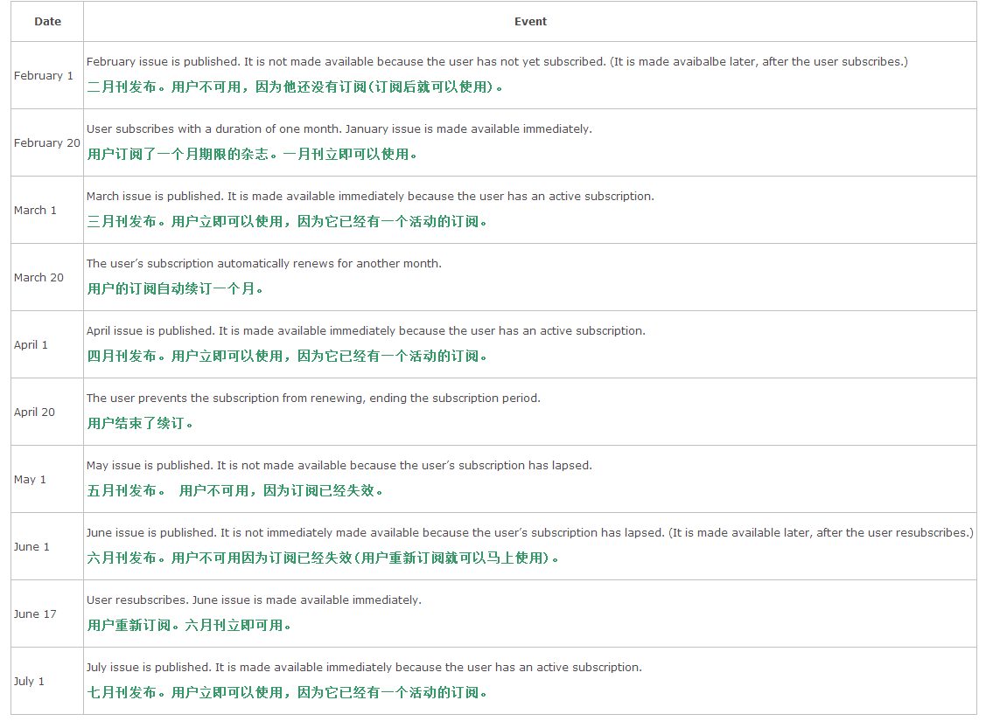

# Working with Subscriptions

Apps that use subscriptions have some additional behaviors and considerations. Because subscriptions incorporate an element of time, your app needs to have the appropriate logic to determine whether the subscription is currently active and what time periods the subscription was active in the past. Your app also needs to react to new and renewed subscriptions, and properly handle expired subscriptions. Figure 5-1 shows an example subscription timeline, including some of the complexities your app needs to handle.

使用订阅 (subscriptions) 的应用有一些额外的行为和注意事项 (considerations) 。 因为订阅包含时间元素，应用程序需要有适当的逻辑来决定订阅当前是否处于活动状态以及过去该订阅活动的时间段。 应用程序还需要应对新的和更新的订阅，并且需要正确地处理过期订阅。 图5-1 举了一个订阅时间表的例子，包括一些应用程序需要处理的复杂事项 (complexities )。

Figure 5-1  Example subscription timeline


## Calculating a Subscription’s Active Period

一、计算一个订阅的活动期
Your app needs to determine what content the user has access to based on the period of time the subscription was active. Consider, for example, a user with a subscription to a magazine that publishes a new issue on the first day of each month, following the timeline shown in Table 5-1.

应用程序需要在订阅处于活动状态的期间内决定用户访问什么内容。 举个例子，一个用户订阅了一个杂志，该杂志在每个月的第一天发布新刊，如图5-1中的时间表：

Table 5-1  Timeline of a sample subscription 表 5-1 一个示例订阅的时间表



To implement this logic in your app, keep a record of the date that each piece of content is published. Read the Original Purchase Date and Subscription Expiration Date field from each receipt entry to determine the start and end dates of the subscription. (For information about the receipt, see *[Receipt Validation Programming Guide](https://developer.apple.com/library/ios/releasenotes/General/ValidateAppStoreReceipt/Introduction.html#//apple_ref/doc/uid/TP40010573)*.) The user has access to all content published between each start and end date, as well as the content that was initially unlocked when the subscription was purchased. If the subscription lapsed, there will be multiple periods of time during which the subscription was active, and there will be pieces of content unlocked at the beginning of a subscription period.

要想在应用程序中实现该逻辑，保留一个关于每刊内容发布的日期记录。 从每个收据项目中读取初始购买日期和订阅到期时期来决定订阅的开始和结束日期。 (关于收据的更多信息，请看 *[Receipt Validation Programming Guide](https://developer.apple.com/library/ios/releasenotes/General/ValidateAppStoreReceipt/Introduction.html#//apple_ref/doc/uid/TP40010573)*.) 用户可以访问所有在开始日期和结束日期之间发布的内容以及它初次购买时解锁的内容。 如果订阅失效(lapsed),将由订阅活动期间的多个时间期，以及在一个订阅期的开始时又多刊内容解锁。

Note: Don’t calculate the subscription period by adding a subscription duration to the purchase date. This approach fails to take into account the free trial period, the marketing opt-in period, and the content made available immediately after the user purchased the subscription.

注意：不要通过添加一个订阅持续时间到购买日期中来计算订阅期。 该方法没有考虑到应用试用期，市场选择期，并让用户购买了订阅之后马上解锁内容。

Continuing the example from Table 5-1, the receipt would show the following start and end dates:

从表5-1开始继续示例，收据将显示以下开始和结束日期：

- February 20 – March 20

- March 20 – April 20

- (The lapse from April 20 – June 17 is not recorded explicitly in the receipt.)

- June 17 – July 17

The user has access to the February and June issues because they were initially unlocked when the subscription was purchased or restarted.

用户可以访问二月和六月刊，因为它们时在订阅被购买或重新订阅时解锁的内容。

The user has access to the March, April, June, and July issues because the subscription is active at those times.

用户可以访问三月，四月，六月以及七月刊，因为在这些时间订阅是活动的。

## Expiration and Renewal

二、到期和续订

The renewal process begins with a “preflight” check, starting ten days before the expiration date. During those ten days, the App Store checks for any issues that might delay or prevent the subscription from being automatically renewed—for example, if the customer no longer has an active payment method, if the product’s price increased since the user bought the subscription, or if the product is no longer available. The App Store notifies users of any issue so that they can resolve it before the subscription needs to renew, ensuring their subscription isn’t interrupted.

续订过程在到期日期前10天开始预检。 在那10天中，应用商店检查任何可能导致自动续订延迟或无法续订的情况---比如，如果用户没有一个可用的支付方法，如果用户购买了订阅之后，产品价格升了，又或者如果产品已经不存在。 应用商店通知用户任何问题，这样他们就可以在续订之前解决这些问题，以确保不会终止他们的续订。

Note: Increasing the price of a subscription doesn’t disable automatic renewal for all customers, only for those customers whose subscription expires in the next ten days. If this change is a mistake, changing it back to the original price means no additional users are affected. If this change is intentional, keeping the new higher price causes automatic renewal to be disabled for the rest of your users in turn as they enter the ten-day renewal window.

注意：提高订阅价格并不会终止所有用户的自动续订，只要那些用户的到期时间是在未来10天之内。 如果该价格改变是一个错误，把价格改回原来的价格并不会影响任何用户。 如果是有意的提交价格，一直保留该新价格将导致依次进入10天续订窗口的其他用户不能进行自动续订。

During the 24-hour period before the subscription expires, the App Store starts trying to automatically renew it. The App Store makes several attempts to automatically renew the subscription over a period of time but eventually stops if there are too many failed attempts.

在订阅到期的前24个小时期间，应用商店开始尝试自动续订。 尽管应用商店在自动续订期间会多次尝试自动续订，但是如果失败次数太多则会终止自动续订。

The App Store renews the subscription slightly before it expires, to prevent any lapse in the subscription. However, lapses are still possible. For example, if the user’s payment information is no longer valid, the first renewal attempt would fail. If the user doesn’t update this information until after the subscription expires, there would be a short lapse in the subscription between the expiration date and the date that a subsequent automatic renewal succeeds. The user can also disable automatic renewal and intentionally let the subscription expire, then renew it at a later date, creating a longer lapse in the subscription. Make sure your app’s subscription logic can handle lapses of various durations correctly.

尽管应用商店在它快要过期之前自动续订来防止丢失任何订阅。 但是，任然有可能丢失。比如，如果用户的支付信息已经失效，第一次续订将失败。 如果用户一直不更新该支付信息直到订阅到期，在到期时间和下一次自动续订成功之前这段时间将有一小段时间的丢失。 用户也可以关闭自动续订并故意让订阅到期，然后在以后续订它，长期丢失订阅。 请确定你的应用程序的订阅逻辑能正确地处理不同时间的丢失。

After a subscription is successfully renewed, Store Kit adds a transaction for the renewal to the transaction queue. Your app checks the transaction queue on launch and handles the renewal the same way as any other transaction. Note that if your app is already running when the subscription renews, the transaction observer is not called; your app finds out about the renewal the next time it’s launched.

当成功续订之后，商店Kit把续订交易添加到交易队列中。应用程序在启动时检查交易队列并且同处理其它任何交易一样处理它。 注意如果在续订时应用程序已经运行，那么交易观察者将不被调用；应用程序在下一次启动时找到续订记录。

## Cancellation

三、取消

A subscription is paid for in full when it’s purchased and can be refunded only by contacting Apple customer service. For example, if the user accidentally buys the wrong product, customer support can cancel the subscription and issue a refund. It’s not possible for customers to change their mind in the middle of a subscription period and decide they don’t want to pay for the rest of the subscription.

购买了一个订阅后得全额付款，只有通过联系苹果客服服务才能退款。 比如，如果用户意外买错了产品，客服中心可以取消该交易并退款。 用户不能在一个订阅周期中间改变注意不支付剩余的订阅。

To check whether a purchase has been canceled, look for the Cancellation Date field in the receipt. If the field has a date in it, regardless of the subscription’s expiration date, the purchase has been canceled—treat a canceled receipt the same as if no purchase had ever been made.

要想确认某次交易是否已经被取消，在收据 (receipt) 中查找 Cancellation Date (取消日期)字段。 如果该字段有日期，不管该订阅的过期日期是什么，该交易都已经被取消---取消交易就是跟一直没有购买过一样。

Depending on the type of product, you may be able to check only the currently active subscription, or you may need to check all past subscriptions. For example, a magazine app would need to check all past subscriptions to determine which issues the user had access to.

根据产品类型，你或许只能检查当前的活动交易，或者你可能需要检查过去所有的交易。比如，一个杂志应用需要检查过去所有的交易来决定用户访问了那些期刊。

## Cross-Platform Considerations

四、跨平台注意事项

Product identifiers are associated with a single app. Apps that have both an iOS and OS X version have separate products with separate product identifiers on each platform. You could let users who have a subscription in an iOS app access the content from an OS X app (or vice versa), but implementing that functionality is your responsibility. You would need some system for identifying users and keeping track of what content they’ve subscribed to, similar to what you would implement for an app that uses non-renewable subscriptions.

产品识别码只能绑定到一个应用程序。同时有 iOS 和 OS X 版本的应用程序是不同的应用程序并分别带有不同的产品识别码。 你可以让在一个 iOS 应用中购买了订阅的用户从 OS X 应用(或其它平台)访问它购买的内容，但是这功能你应该自己实现。你会需要一些系统来识别用户并保持跟踪他们已经订阅了什么内容，类似于你会给一个 no-renewable subscriptions (不可再生订阅)应用程序实现什么。

## Letting Users Manage Subscriptions

五、让用户管理订阅

Rather than needing to code your own subscription management UI, your app can open the following URL:

不需要你自己编码实现自己的订阅管理 UI ，你的应用程序可以打开以下 URL ：

```
https://buy.itunes.apple.com/WebObjects/MZFinance.woa/wa/manageSubscriptions
```
Opening this URL launches iTunes or iTunes Store, and then displays the Manage Subscription page.

打开该 URL 启动 iTunes 或者 iTunes 商店，然后显示管理订阅页面。

## The Test Environment

6、测试环境

For the sake of testing, there are some differences in behavior between auto-renewable subscriptions in the production environment and in the test environment.

为了测试，自动再生订阅在产品环境 (production environment) 和 在测试环境 (test environment) 中的行为有所不同。

Renewal happens at an accelerated rate, and auto-renewable subscriptions renew a maximum of six times per day. This lets you test how your app handles a subscription renewal, a subscription lapse, and a subscription history that includes gaps.

更新发生在加速时，并且自动更新订阅每天最多更新6次。 这样让里测试你的应用程序如何处理一个订阅更新，一个订阅失效，以及一个包括缺口的订阅历史。

Because of the accelerated expiration and renewal rate, the subscription can expire before the system starts trying to renew the subscription, leaving a small lapse in the subscription period. Such lapses are also possible in production for a variety of reasons—make sure your app handles them correctly.

因为加速的到期和更新速度，订阅可以在系统开始尝试更新订阅之前过期，在订阅期间留下一个小失误。 因为各种原因，这样的失误在产品中也同样可能存在---请确保你的应用程序可以正确地处理它们。