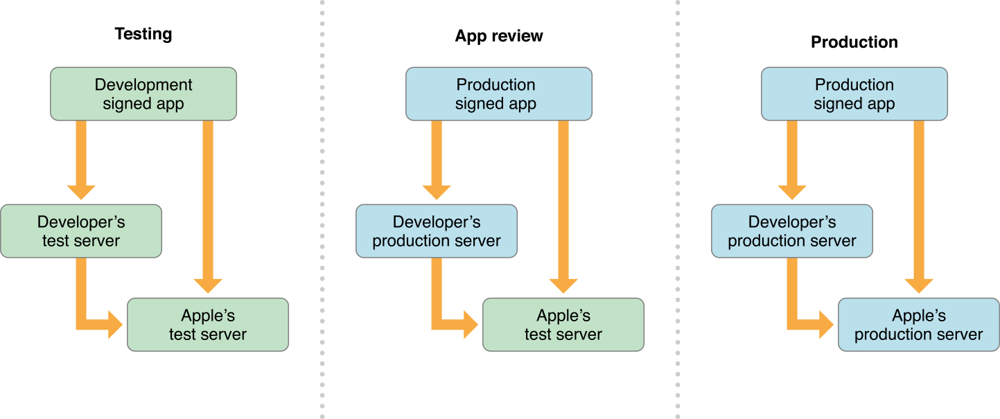

# Preparing for App Review

After you finish testing, you’re ready to submit your app for review. This chapter highlights a few tips to help you through the review process.

当你完成测试以后，就表示已经准备好提交应用以供审核。 该章节重点介绍了一些提示来帮助你通过审核过程。

## Submitting Products for Review

一、递交产品以供审核

The first time you submit your app for review, you also need to submit in-app products to be reviewed at the same time. After the first submission, you can submit updates to your app and products for review independently of each other. For more information, see In-App Purchase Configuration Guide for iTunes Connect.

当你第一次提交审核程序时，你还需要同时提交内置产品以供审核。 第一次递交通过以后，以后更新应用程序和产品时则可以分别提交。 更多信息，请看 In-App Purchase Configuration Guide for iTunes Connect.

## Receipts in the Test Environment

二、在测试环境中的收据

Your app runs different environments while in development, review, and production, as show in Figure 7-1.

当应用程序在开发，审核以及产品过程中，在不同的环境中运行。如下图：

Figure 7-1  Development, review, and production environments

During development, you run a development-signed version of your app, which connects to your development servers and the test environment for the App Store. In production, your users run a production-signed version of your app which connects to your production servers and the production App Store. However, during app review, your app runs in a mixed production/test environment: it’s production signed and connects to your production servers, but it connects to the test environment for the App Store.

在开发过程中，应用程序的版本是一个开发签名的版本，它连接到你的开发服务器以及应用程序中的测试环境。 在产品过程中，你的用户运行一个产品签名版本的应用程序，它连接到你的产品服务器以及产品应用商店。 然而，在应用程序审核过程中，你的应用程序运行在一个混合的产品/测试环境中：它是产品签名并且连接到你的产品服务器，但是它连接到应用商店的测试环境中。

When validating receipts on your server, your server needs to be able to handle a production-signed app getting its receipts from Apple’s test environment. The recommended approach is for your production server to always validate receipts against the production App Store first. If validation fails with the error code “Sandbox receipt used in production”, validate against the test environment instead.

当你验证在服务器中的收据时，你的服务器需要能够处理一个产品签名的应用程序，它从苹果的测试环境中获取它的收据。 推荐方法是总是首先为你的产品服务器激活收据而不是为产品应用商店。 如果激活出现 “Sandbox receipt used in production" 错误，则验证测试环境。

## Implementation Checklist

三、实现核对清单

Before you submit your app for review, verify that you’ve implemented all of the required behavior. Make sure you’ve implemented the following core In-App Purchase behavior (listed in order of a typical development process):

在递交你的审核应用之前，验证你已经实现了所有需要的行为。 确保你已经实现了以下内核内置购买行为(以一个典型的开发过程顺序列出)：

Create and configure products in iTunes Connect.

在 iTunes Connect里创建并配置产品。

- You can change your products throughout the process, but you need at least one product configured before you can test any code.

你可以在过程中更改产品，但是在测试任何代码前，你至少需要一个已经配置好的产品。

- Get a list of product identifiers, either from the app bundle or your own server. Send that list to the App Store using an instance of SKProductsRequest.

从应用束或服务器上获取产品识别码列表 (product identifiers). 用一个 SKProductsRequest 实例把列表发送给应用商店。

- Implement a user interface for your app’s store, using the instances of SKProduct returned by the App Store. Start with a simple inteface during development, such as a table view or a few buttons.

Implement a final user interface for your app’s store at whatever point makes sense in your development process.

使用应用商店返回的 SKProduct ,为应用商店实现一个用户界面。开发过程中使用一个简单的界面，比如一个表格视图或一些按钮。在开发过程中运行顺利后可以实现一个最终的用户界面。

- Request payment by adding an instance of SKPayment to the transaction queue using the addPayment: method of SKPaymentQueue.

使用 SKPaymentQueue的addPayment: 方法来添加一个 SKPayment 的实例到交易队列，用来请求支付。

- Implement a transaction queue observer, starting with the paymentQueue:updatedTransactions: method.

使用 paymentQueue:updateTransactions: 方法来实现一个交易队列观察者 (transaction queue observer)。

Implement the other methods in the SKPaymentTransactionObserver protocol at whatever point makes sense in your development process.

在你的开发过程中有任何需要时， 在 SKPaymentTransactionObserver 协议里实现其它方法。

- Deliver the purchased product by making a persistent record of the purchase for future launches, downloading any associated content, and finally calling thefinishTransaction: method of SKPaymentQueue.

为了以后能够启动，做一个永久交易记录，传递已被购买的产品，下载全部相关内容，并在最后调用  SKPaymentQueue 的 finishTransaction:方法。

During development, you can implement a trivial version of this code at first—for example, simply displaying “Product Delivered” on the screen—and then implement the real version at whatever point makes sense in your development process.

在开发过程中，你可以只实现一个该代码的简易版本--比如，只是简单的在屏幕上显示“Product Delivered” 字样---然后在开发过程中有任何需要时实现真实版本。 

If your app sells non-consumable items, auto-renewable subscriptions, or non-renewing subscriptions, verify that you’ve implemented the following restoration logic:

如果你的应用程序出售非耗材产品，自动更新订阅，或者非自动更新订阅，验证你已经实现了以下恢复逻辑：

- Provide UI to begin the restoration process.

提供 UI 来开启恢复过程。 

- Retrieve information about past purchases by either refreshing the app receipt using the SKReceiptRefreshRequest class or restoring completed transactions using the restoreCompletedTransactions method of the SKPaymentQueue class.

通过使用 SKReceiptRefreshRequest 类来刷新应用收据或者使用 SKPaymentQueue 类的  restoreCompletedTransactions 方法来恢复完整交易，来获取过去购买的信息。

- Let the user re-download content.

允许用户重新下载内容。

If you use Apple-hosted content, restore completed transactions and use the transaction’s downloads property to get an instance of SKDownload.

如果你使用了苹果托管内容，恢复完整交易并使用交易的downloads特性得到一个SKDownload类的实例。

- If you host your own content, make the appropriate calls to your server.

如果你自己托管自己的内容，正确访问你的服务器。

If your app sells auto-renewable or non-renewing subscriptions, verify that you’ve implemented the following subscription logic:

如果你的应用程序出售自动更新或非自动更新订阅，验证你已经实现了以下订阅逻辑：

- Handle a newly-purchased subscription by delivering the most recently published piece of content—for example, the latest issue of a magazine.

通过传递最新发布的内容片断来处理一个崭新的购买订阅---比如，一本杂志最新的问题。

- When new content is published, make it available to the user.

当新内容发布时，用户是可以使用的。

- When a subscription expires, let the user renew it.

当一个订阅到期后，允许用户重新更新它。

If your app sells auto-renewable subscriptions, let the App Store handle this process. Don’t try to handle it yourself.

如果你的应用程序出售自动更新订阅，允许应用商店处理该过程。不要尝试自己来处理。

If your app sells non-renewing subscriptions, your app is responsible for this process.

如果你的应用程序出售非自动更新订阅，你的应用程序负责该过程。

- When a subscription becomes inactive, stop making new content available. Update your interface so the user has the option to purchase the subscription again, re-activating it.

当一个订阅到期后，停止用户使用新内容。更新你的界面，这样用户就可以选择再次购买该订阅并重新激活它的内容。

- Implement some system to keep track of when content was published. Use this system when restoring purchases to give the user access to the content that was paid for, based on the periods of time the subscription was active.

实现一个系统来跟踪最新发布的内容。 当恢复购买时，使用该系统，让用户可以根据订阅激活的时间来访问他们已经支付的内容。