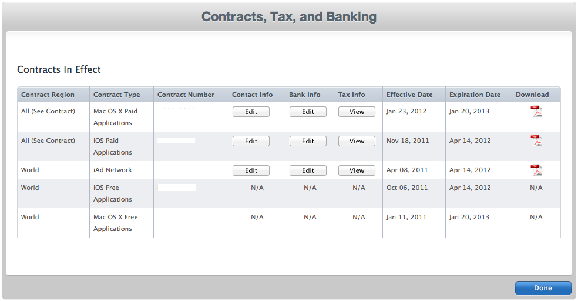
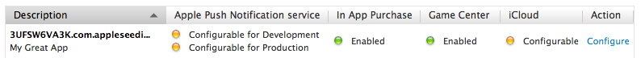
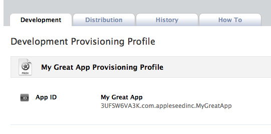
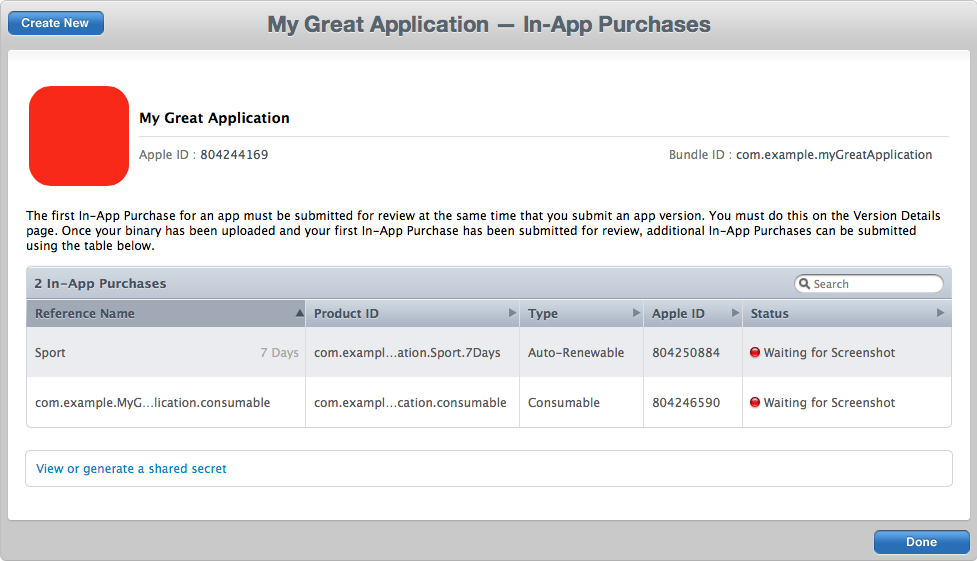
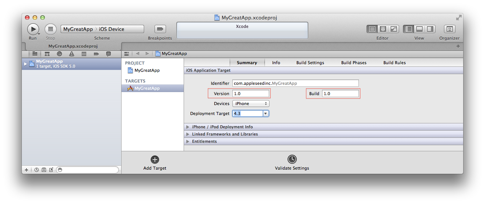

# Adding In-App Purchase to your iOS and OS X Applications

In-App Purchase allows you to sell additional features and functionality from within your iOS and OS X applications. If you wish to offer In-App Purchase in your applications, you must complete several steps before you can do it. This document provides step-by-step instructions for setting up and testing In-App Purchase. It also answers common questions about In-App Purchase. The "Contracts, Tax, and Banking Information" section describes all the financial documents that must be completed. The "Member Center" and "iTunes Connect" sections indicate the steps to be respectively done in the Member Center and iTunes Connect. The "What's Next" section shows how to test In-App Purchase.

内置购买让你从 iOS 和 OS X应用内部销售更多的特性和功能。 如果你想在应用程序里提供内置购买，你必须完成以下步骤。 本文一步一步介绍配置和测试内置购买，以及回答内置购买的常见问题。 “Contracts, Tax, and Banking Information”一节描述了所有必须完成的财务文件。在 “Member Center”和 “iTunes Connect”部分讲述了需要在 Member Center 和 iTunes Connect 里需要完成的步骤。“What's Next”一节演示如何测试应用程序内置购买。

This document does not cover how to implement In-App Purchase in your applications. Read the [In-App Purchase Programming Guide](https://developer.apple.com/library/ios/documentation/NetworkingInternet/Conceptual/StoreKitGuide/Introduction.html) for detailed information about implementing In-App Purchase in your applications.

本文没有覆盖如何在你的应用程序中实现内置购买。阅读 [In-App Purchase Programming Guide](https://developer.apple.com/library/ios/documentation/NetworkingInternet/Conceptual/StoreKitGuide/Introduction.html) 来了解在应用程序中实现内置购买的详细情况。

Note: In-App Purchase is available in iOS 3.0 and later and OS X 10.7 and later.

注意：内置购买仅在 iOS 3.0 及以后版本，OS X 10.7 及以后版本中有效。

[Contracts, Tax, and Banking Information](https://developer.apple.com/library/ios/technotes/tn2259/_index.html#//apple_ref/doc/uid/DTS40009578-CH1-CONTRACTS__TAX__AND_BANKING_INFORMATION)
[Member Center](https://developer.apple.com/library/ios/technotes/tn2259/_index.html#//apple_ref/doc/uid/DTS40009578-CH1-MEMBER_CENTER)
[iTunes Connect](https://developer.apple.com/library/ios/technotes/tn2259/_index.html#//apple_ref/doc/uid/DTS40009578-CH1-ITUNES_CONNECT)
[What's Next?](https://developer.apple.com/library/ios/technotes/tn2259/_index.html#//apple_ref/doc/uid/DTS40009578-CH1-WHAT_S_NEXT_)
[Frequently Asked Questions](https://developer.apple.com/library/ios/technotes/tn2259/_index.html#//apple_ref/doc/uid/DTS40009578-CH1-FREQUENTLY_ASKED_QUESTIONS)
[References](https://developer.apple.com/library/ios/technotes/tn2259/_index.html#//apple_ref/doc/uid/DTS40009578-CH1-FREQUENTLY_ASKED_QUESTIONS)
[Document Revision History](https://developer.apple.com/library/ios/technotes/tn2259/_index.html#//apple_ref/doc/uid/DTS40009578-RevisionHistory-DontLinkElementID_1)

## Contracts, Tax, and Banking Information

一、合同，税以及银行信息

You must complete the following steps before you can support In-App Purchase in your applications:

你必须在应用程序中支持内置购买之前完成以下步骤：

1.Agree to the latest Developer Program License Agreement.

同意最新的开发者计划许可协议。

Your Team agent must agree to the latest iOS Developer Program License Agreement (iOS) or to the latest Mac Developer Program License Agreement (OS X) in the Member Center before you are allowed to create In-App Purchase products.

在允许你创建内置购买产品之前，你的团队必须同意Member Center中的最新的iOS开发者计划许可协议 (iOS) 或者同意最新的 Mac 开发者计划许可协议 (OS X)。

2.Complete your contract, tax, and banking Information.

完成你的合同，税以及银行信息。

You must have an iOS Paid Applications contract (iOS) or a Mac OS X Paid Applications contract (OS X) in effect with Apple and have provided your tax and banking information in [iTunes Connect](http://itunesconnect.apple.com/) as seen in Figure 1.

你必须有一个与苹果相关的有效iOS 支付应用合同 (iOS) 或一个  Mac OS X 支付应用合同 (OS X)，并且已经在 [iTunes Connect](http://itunesconnect.apple.com/)  中提供了你的税以及银行信息，如下图：

Figure 1  Contract section in iTunes Connect



## Member Center

二、 Member Center

The Member Center is used to configure your App ID and Provisioning Profiles for In-App Purchase. OS X and iOS developers must complete the following steps in the[Member Center](http://developer.apple.com/membercenter) :

会员中心用来配置你的 App ID 以及内置购买的配置信息(Provisioning Profiles). OS X 和 iOS 开发者必须在 [Member Center](http://developer.apple.com/membercenter) 中完成以下步骤：

1.Register an explicit App ID for your application.

为你的应用程序注册一个 explicit App ID.

Explicit App IDs are App IDs whose Bundle Identifier portion is a string without the wildcard ("*") character. Furthermore, they are automatically registered for In-App Purchase and Game Center as shown in Figure 2. Using an explicit App ID ensures that your In-App Purchase products are only associated with your application. For example, use com.example.MyGreatApplication rather than com.example.*.

Explicit App ID 的捆绑标识符 (Bundle Identifier)部分是由不包含通配符"*"的字符串组成的App ID。此外，它们会自动开启内置购买 (In App Purchase)和游戏中心 (Game Center)，如图2。 使用一个 explicit App ID确保你的内置购买只跟你的应用程序相关联。 举个例子，使用 com.example.MyGreatApplication 而不是 com.example.*. 

Your Team Agent or Team Admin should navigate to the App IDs section of the Member Center to create App IDs for your applications. Read [Registering App IDs](https://developer.apple.com/library/ios/documentation/IDEs/Conceptual/AppDistributionGuide/MaintainingProfiles/MaintainingProfiles.html)  in the App Distribution Guide to find out how to create App IDs.

你的团队代理人或团队管理者应该到 Member Center的 App IDs 区为你的应用程序创建 App IDs。请阅读 App Distribution Guide的 [Registering App IDs](https://developer.apple.com/library/ios/documentation/IDEs/Conceptual/AppDistributionGuide/MaintainingProfiles/MaintainingProfiles.html) 来找出如何创建 App ID。

Figure 2  Explicit App ID



1.Certificates and Provisioning Profiles.

证书和配置信息

- iOS developers must create, download, and install a new Development Provisioning Profile that uses their App ID enabled for In-App Purchase as seen in Figure 3. Read [Creating Provisioning Profiles Using Member Center](https://developer.apple.com/library/ios/documentation/IDEs/Conceptual/AppDistributionGuide/MaintainingProfiles/MaintainingProfiles.html#//apple_ref/doc/uid/TP40012582-CH30-SW24) and [Refreshing Provisioning Profiles in Xcode](https://developer.apple.com/library/ios/documentation/IDEs/Conceptual/AppDistributionGuide/MaintainingProfiles/MaintainingProfiles.html#//apple_ref/doc/uid/TP40012582-CH30-SW26) in the App Distribution Guide to learn how to create and install Provisioning Profiles.

iOS 开发者必须用他们的 App ID 创建，下载和安装一个新的 Development Provisioning Profile，用来开启内置购买，如图3. 阅读 App Distribution Guide 中的 [Creating Provisioning Profiles Using Member Center](https://developer.apple.com/library/ios/documentation/IDEs/Conceptual/AppDistributionGuide/MaintainingProfiles/MaintainingProfiles.html#//apple_ref/doc/uid/TP40012582-CH30-SW24) 和[Refreshing Provisioning Profiles in Xcode](https://developer.apple.com/library/ios/documentation/IDEs/Conceptual/AppDistributionGuide/MaintainingProfiles/MaintainingProfiles.html#//apple_ref/doc/uid/TP40012582-CH30-SW26)  来学习如何创建和安装配置信息。

- OS X developers must create, download, and install a Mac Development Certificate that uses their App ID enabled for In-App Purchase. Read [Requesting Signing Identities](https://developer.apple.com/library/mac/documentation/IDEs/Conceptual/AppDistributionGuide/MaintainingCertificates/MaintainingCertificates.html#//apple_ref/doc/uid/TP40012582-CH31-SW6) in the App Distribution Guide to learn how to create a Mac Development certificate.

OS X 开发者必须用他们的 App ID 创建，下载和安装一个新  Development Provisioning Profile，用来开启内置购买。阅读 App Distribution Guide 中的 [Requesting Signing Identities](https://developer.apple.com/library/mac/documentation/IDEs/Conceptual/AppDistributionGuide/MaintainingCertificates/MaintainingCertificates.html#//apple_ref/doc/uid/TP40012582-CH31-SW6) 来学习如何创建一个 Mac 开发证书。

Figure 3  Provisioning Profile



## iTunes Connect

三、iTunes Connect

To test In-App Purchase, you need to create products to purchase and test accounts to make the purchases. iTunes Connect allows you to create and manage In-App Purchase products and Test User accounts. Both iOS developers and OS X developers must complete the following steps in iTunes Connect:

要想测试内置购买，你需要创建能购买的产品和测试账号。 iTunes Connect 里可以创建并管理内置购买产品和测试用户账号。 iOS 和 OS X 开发者必须在 iTunes Connect 中完成以下步骤：

1.Create test user accounts.

创建测试用户账号。

Apple provides a testing environment, called the sandbox, which allows you to test your In-App Purchase products without incurring any financial charges. The sandbox environment uses special test user accounts rather than your regular iTunes Connect accounts to test In-App Purchase. See Test Users in the iTunes Connect Developer Guide for more information about creating test user accounts.

苹果提供了一个测试环境，叫做 sandbox (沙盒), 它让您无需承担任何财务费用测试你的程序内置购买的产品。

Note: You can use the same test user accounts to test both your iOS and OS X applications. Each In-App Purchase test user account is tied to one and only one email address. As such, you cannot reuse an existing email address with another test user account. You can create as many test user accounts as you want in iTunes Connect. Furthermore, if your email service provider supports email addresses with "+" sign, you can use that as an alias for your normal email address. For instance, if your email is foo@example.com, then you can use the foo+us@example.com, foo+uk@example.com, and foo+fr@example.com emails when creating test user accounts in iTunes Connect. All communications sent to foo+us@example.com, foo+uk@example.com, and foo+fr@example.com will be routed to foo@example.com.

注意：你可以使用同样的测试用户账号来测试 iOS 和 OS X 应用。 每个内置购买测试用户账号只绑定到一个 email 地址上。 因此，你不能用同一个 email 账号绑定另一个测试账号。 你可以在 iTunes Connect 中创建任意多的测试账号。另外，如果你的 email 服务提供商支持“+”标记的 email 地址，你可以把它作为你的 email 地址的别名。 比如，如果你的 email 地址是 foo@example.com, 在iTunes Connect 中创建测试用户账号时，你可以使用 foo+us@example.com, foo+uk@example.com,以及 foo+fr@example.com 等。 所有发送到 foo+us@example.com, foo+uk@example.com,以及 foo+fr@example.com 中的通信都会转发到 foo@example.com。

2.Create In-App Purchase products.

创建内置购买产品。

Creating In-App Purchase products is available via the Manage In-App Purchases feature in iTunes Connect.

通过 iTunes Connect 中的内置购买功能创建有效的内置购买产品。

Your Admin or Technical users should navigate to the Manage Your Applications in iTunes Connect, select the application for which they want to create In-App Purchase products, then click on the Manage In-App Purchases button in the ensuing page for this application. See [Creating In-App Purchase Products](https://developer.apple.com/library/ios/documentation/LanguagesUtilities/Conceptual/iTunesConnectInAppPurchase_Guide/Chapters/CreatingInAppPurchaseProducts.html) in the In-App Purchase Configuration Guide for iTunes Connect for more information about creating In-App Purchase products.

管理员或技术人员应该到 iTunes Connect 中的 Manage Your Applications，选择他们想要创建内置购买产品的应用，然后在确定页面中点击管理内置购买按钮 (Manage In-App Purchases button)。 参见In-App Purchase Configuration Guide for iTunes Connect 中的 [Creating In-App Purchase Products](https://developer.apple.com/library/ios/documentation/LanguagesUtilities/Conceptual/iTunesConnectInAppPurchase_Guide/Chapters/CreatingInAppPurchaseProducts.html) 来了解关于创建内置购买产品的更多信息。

- Fill out the In-App Purchases form.

填写内置购买表格

The In-App Purchase form contains the Product ID field, which specifies a unique identifier for each of your In-App Purchase products. See [Technical Q&A QA1329, 'In-App Purchase Product Identifiers'](http://developer.apple.com/iphone/library/qa/qa2009/qa1329.html) for more information about product identifiers and how to access the form.

内置购买表格包括产品 ID 字段，它为每个内置购买产品指定一个唯一的标示符 (identifier) ， 参见 [Technical Q&A QA1329, 'In-App Purchase Product Identifiers'](http://developer.apple.com/iphone/library/qa/qa2009/qa1329.html)' 来了解产品识别码的更多信息，以及如何访问该表格。

- Leave the state of your product as Waiting for Screenshot as shown in Figure 4.

让你的产品状态保留在等待截图 (Waiting for Screenshot) 状态，如图4.

Note: Upload a a screenshot of your In-App Purchase product once you are done testing it and ready to upload it for review.

注意：当你完成测试并准备好提交审核时，上传一张内置购买产品的截图。

- Clear your product for sale.

准备出售

The In-App Purchases form contains a Cleared for Sale checkbox, which determines whether your In-App Purchase product will be available for purchase from within your application. Check that box to make sure your product is available for sale.

在内置购买表格中包含了一个 Cleared for Sale 选择框，它用来确定你的内置购买产品是否能在你的应用中出售。 选中该选择框来确保你的产品已能出售。

Figure 4  Status of Product IDs



## What's Next?

四、接下来。。。。

You have successfully set up In-App Purchase for your application, let's implement and test it:

你已经成功为你的应用程序设置了内置购买功能，让我们实现并测试它：

1.Launch or create your project in Xcode.

用 Xcode 启动或创建你的项目。

2.Enter the Bundle Identifier portion of your App ID in the Bundle Identifier field of your Target's Info pane in Xcode.

进入 Xcode 的 Target 的 Info 面板，在 Bundle Identifier 字段输入你的 App ID 。

3.Enter a version number (CFBundleVersion) and a build number (CFBuildNumber) in the Version and Build fields of your Target's Summary Pane in Xcode, respectively as seen in Figure 5.

Note: CFBundleVersion and CFBuildNumber are strings that can only contain positive integers and and period (.) characters. See [CFBundleVersion](http://developer.apple.com/library/ios/#documentation/General/Reference/InfoPlistKeyReference/Articles/CoreFoundationKeys.html) for more information.

打开 Target 的 Summary 面板，在 Version 和 Build 字段输入一个版本号 (CFBundleVersion) 和一个构建号(CFBuildNumber)，参见图5.

注意： CFBundleVersion 和 CFBuildNumber 是只能包含正整数和"."的字符串。参见[CFBundleVersion](http://developer.apple.com/library/ios/#documentation/General/Reference/InfoPlistKeyReference/Articles/CoreFoundationKeys.html)学习更多信息。

Figure 5  Setting the version and build in the Summary pane



1.2.Sign your application.

给你的应用程序签名。

Navigate to the Build Settings pane of your Target and select the iOS Development Certificate/Provisioning Profile pair (iOS) or Mac signing certificate (OS X) associated with your App ID in the code signing identity section.

进入Target的 Build Setting 面板，在 code signing identity 区选择跟你的 App ID 相关联的 iOS Development Certificate/Provisioning Profile pair (iOS) or Mac signing certificate (OS X)。

2.Write code for your application.

编写你的应用程序代码。

- Both iOS developers and OS X developers should read the [In-App Purchase Programming Guide](https://developer.apple.com/library/ios/documentation/NetworkingInternet/Conceptual/StoreKitGuide/Introduction.html) and [Receipt Validation Programming Guide](https://developer.apple.com/library/ios/releasenotes/General/ValidateAppStoreReceipt/Introduction.html) for detailed information about implementing In-App Purchase in your applications and receipt validation, respectively.

iOS 开发者和 OS X 开发者都应该分别阅读 [In-App Purchase Programming Guide](https://developer.apple.com/library/ios/documentation/NetworkingInternet/Conceptual/StoreKitGuide/Introduction.html) 和 [Receipt Validation Programming Guide](https://developer.apple.com/library/ios/releasenotes/General/ValidateAppStoreReceipt/Introduction.html)，以学习在应用程序中实现内置购买的详细信息。

Important: The Feature Delivery section of the In-App Purchase Programming Guide describes how to request information about your products from the App Store. Apple strongly recommends that you populate your user interface with products that were returned by the App Store. This ensures that your customers are only presented with products they can buy.

重要提示：In-App Purchase Programming Guide 的 Feature Delivery 章节描述了如何从应用商店请求关于你的产品的相关信息。苹果强烈推荐你使用应用商店返回的带有产品的用户界面。这样能确保你的用户看到的是它们能够购买的产品。

- OS X applications should perform receipt validation immediately after launch. The apps should call exit with a status of 173 if validation fails as shown in Listing 1.

OS X 应用程序应该在启动后立即执行 receipt 验证。 如果验证失败，应用程序应该调用 exit(173) ，如列表1：

Listing 1  Receipt validation
 
```
-(void)applicationWillFinishLaunching:(NSNotification *)notification
{
   // Locate the receipt
   NSURL *receiptURL = [[NSBundle mainBundle] appStoreReceiptURL];
 
   // Test whether the receipt is present at the above path
   if(![[NSFileManager defaultManager] fileExistsAtPath:[receiptURL path]])
   {
        // Validation fails
        exit(173);
   }
 
   // Proceed with further receipt validation steps
}
```

3.Test your application in the sandbox environment.

在沙盒环境测试你的应用程序。

- iOS developers must complete the following steps:

iOS 开发者必须完成以下步骤：

- Sign out of the Store in the Settings application on your testing device.

在你的测试设备上，打开”设置“应用程序，登出应用商店。 

- Set the run destination of your application to an iOS Device in Xcode.

在 Xcode 中，选择你的运行设备。

- Build and run your application from Xcode.

 从 Xcode 构建并运行你的应用程序。

- OS X developers must complete the following steps:

OS X开发者必须完成以下步骤：

- Build your application in Xcode.

在 Xcode 中构建你的应用程序。

- Run your application.

运行你的应用程序

You must launch your application from the Finder rather than from Xcode the first time in order to obtain a receipt. Click on your application in the Finder to launch it. OS X displays a "Sign in to download from the App Store." dialog. Enter your test user account and password as requested. The sandbox provides you with a new receipt upon successful authentication.

Note: Launch your application from the Finder whenever you need a new receipt.

第一次启动你的应用程序时，从你的 Finder 启动来获得一个receipt ，而不是从 Xcode 启动。在 Finder 中点击启动你的应用程序。 OS X 显示一个 ”Sign in to download from App Store“ 对话框。 输入你的测试用户账号和密码。 成功验证后，沙盒给你一个新的 receipt 。

注意：任何时候需要一个新的 receipt 时，就从 Finder 启动你的应用程序。

Important: Use your test user account when prompted by Store Kit to confirm a purchase from within your application.

重要提示：在你的应用程序中，如果 Store Kit 要求你确认一次购买，使用你的测试用户账号。 

Store Kit connects to the sandbox environment when you launch your application from Xcode, from your test device (iOS), or from the Finder (OS X). It connects to a production environment for applications that were downloaded from the App Store. You must not use your test user account to sign into the production environment. This will result in your test user account becoming invalid. Invalid test accounts cannot be used to test In-App Purchase again.

当你从 Xcode(iOS) 或者 Finder(OS X) 启动你的应用程序时，Store Kit 连接到沙盒环境。当从应用商店下载应用程序并启动时，它连接到一个产品环境 (production environment) 。 你绝对不能用你的测试账户登陆产品环境。这将让你的测试账户无效。无效测试账户不能再次用来测试内置购买。

Submit your In-App Purchase products for review.

提交你的内置购买产品以供审核。

Log in to [iTunes Connect](http://itunesconnect.apple.com/) to submit your In-App Purchase products for review by Apple, after you are done thoroughly testing them in the sandbox environment.

当你在沙盒环境中测试成功后，登陆 [iTunes Connect](http://itunesconnect.apple.com/) ，提交你的内置购买产品让苹果审核。
 
### Frequently Asked Questions

五、常见问题解答

How many In-App Purchase product IDs can we create per application in iTunes Connect?

在iTunes Connect中，每个应用程序可以创建多少格内置购买产品 ID ？

Read [Configuring a Product](https://developer.apple.com/library/ios/documentation/LanguagesUtilities/Conceptual/iTunesConnectInAppPurchase_Guide/Chapters/CreatingInAppPurchaseProducts.html#//apple_ref/doc/uid/TP40013727-CH3-SW3) in the In-App Purchase Configuration Guide for iTunes Connect to find out how many In-App Purchase product IDs you can create per application.

阅读 In-App Purchase Configuration Guide for iTunes Connect 中的[Configuring a Product](https://developer.apple.com/library/ios/documentation/LanguagesUtilities/Conceptual/iTunesConnectInAppPurchase_Guide/Chapters/CreatingInAppPurchaseProducts.html#//apple_ref/doc/uid/TP40013727-CH3-SW3)来寻找答案。

2.My iOS application is currently signed with a Provisioning Profile that uses a wildcard App ID. How do I enable my App ID to support In-App Purchase?

我的iOS应用程序当前是使用了一个 wildcard App ID 的 Provisioning Profile 来签名的。我应该如何让我的 App ID 支持内置购买？

Read [Editing App IDs](https://developer.apple.com/library/ios/documentation/IDEs/Conceptual/AppDistributionGuide/MaintainingProfiles/MaintainingProfiles.html#//apple_ref/doc/uid/TP40012582-CH30-SW4) in the App Distribution Guide to learn how you can enable your App ID to support In-App Purchase.

阅读 App Distribution Guide 的 https://developer.apple.com/library/ios/documentation/IDEs/Conceptual/AppDistributionGuide/MaintainingProfiles/MaintainingProfiles.html#//apple_ref/doc/uid/TP40012582-CH30-SW4 来学习如何让你的 App ID 支持内置购买。

3.I cannot find the Manage In-App Purchases button in iTunes Connect?

不在 iTunes Connect 中找不到 Manage In-App Purchase 按钮？

The Manage In-App Purchases button may not be available to you for one or more of the following reasons:

由于以下原因，你或许没有 Manage In-App Purchase 按钮：

- You are not an Admin or Technical user for your iTunes Connect account.

你的 iTunes Connect 账号不是一个管理员或技术人员账号。

- Your Team Agent has not agreed to the latest iOS or Mac Developer Program License Agreement.

你的团队代理人还没有同意最新的 iOS 或 Mac 开发者计划许可协议( Developer Program License Agreement)。

- You do not have the latest Paid Applications contract in effect.

你没有最新支付的应用合同。 

4.Must I upload a binary to test In-App Purchase?

我必须上传一个二进制文件来测试内置购买吗？ 

No. Testing In-App Purchase does not require uploading a binary.

Important: DO NOT upload the development binary to iTunes Connect until the application is ready for App Review approval. If the binary is present in iTunes Connect and it is not fully functional, App Review will review the binary and likely reject the development binary. Testing In-App Purchase will fail if you or App Review reject your most recent binary in iTunes Connect. The workaround in this case is to upload a binary without In-App Purchase features that can get approved by App Review. Once the binary is approved, resume testing the binary with In-App Purchase features.

不需要，测试内置购买不要求上传一个二进制文件。

重要提示：不要把开发二进制上传到iTunes Connect，直到应用程序审核通过。如果iTunes Connect里有二进制文件，并且它的功能还不完善，应用审核时会审核该二进制并且很可能会驳回该开发二进制文件。 如果你或应用审核驳回你在iTunes Connect中最近的二进制文件，测试内置购买将失败。这种情况的变通办法是上传一个没有内置购买功能的二进制文件，这样就可以被审核通过。当二进制文件审核通过以后，恢复带有内置购买功能的二进制测试。

5.How do I resolve the 'Your account info has changed' error?

我该如何解决“你的账户信息已经改变”错误？

You are getting the 'Your account info has changed' error because you are signed in with your test user account on your device while testing In-App Purchase. To resolve this error, sign out of the Store in the Settings application on your device, create a new test user account in iTunes Connect, and use it when testing In-App Purchase.

你之所以得到这个错误，是因为你在测试内置购买时用测试用户账号登陆了设备。 解决该错误的办法是，在设备的设置那登出应用商店，然后在 iTunes Connect 重新创建一个新的测试用户账号并用它测试内置购买。

6.Why are my product identifiers being returned in the invalidProductIdentifiers array?

为什么我的产品标识符在 invalidProductIdentifiers 数组中返回？

Your product identifiers may be returned in the invalidProductIdentifiers array for one or more of the following reasons:

这可能是以下原因造成的：

You did not complete all the financial requirements (see the "Contracts, Tax, and Banking Information" section of this document).

你没有完成所有的财务要求(查看本文的 “Contracts, Tax, and Banking Information” 章节)。

You did not use an explicit App ID.

你没有使用一个 explicit App ID.

- You did not use the Provisioning Profile associated with your explicit App ID.

你没有使用跟你的 explicit App ID 相关联的 Provisioning Profile . 

- You did not use the correct product identifier in your code. See [Technical Q&A, QA1329, 'In-App Purchase Product Identifiers](http://developer.apple.com/iphone/library/qa/qa2009/qa1329.html)' for more information about product identifiers.

你在代码中没有使用正确的产品标识符。 关于产品标识符，请看[Technical Q&A, QA1329, 'In-App Purchase Product Identifiers](http://developer.apple.com/iphone/library/qa/qa2009/qa1329.html)' 以获得更多信息。

- You did not clear your In-App Purchase products for sale in iTunes Connect.

你没有在iTunes Connect中出售你的内置购买产品。

- You might have modified your products, but these changes are not yet available to all the App Store servers.

你或许已经修改了你的产品，但是这些更改并不是适用于所有的应用商店服务器。

- If you or App Review rejected your most recent binary in iTunes Connect.

你活着应用审查驳回了你在 iTunes Connect 中最新的二进制文件。 

7.How do I resolve the "You've already purchased this In-App Purchase but it hasn't been downloaded." error message?

我该如何解决“你已经完成了该内置购买，但是它还没被下载。”错误信息？

You are getting the "You've already purchased this In-App Purchase but it hasn't been downloaded." error message because you did not callSKPaymentQueue 's finishTransaction:method in your application. Calling finishTransaction: allows you to remove a transaction from the payment queue.

这是因为你没有在你的应用程序里调用 SKPaymentQueue 的 finishTransaction: 方法。 调用该方法把一个交易从支付列表里移除。

8.How do I resolve the "You've already purchased this. Tap OK to download it again for free." error message?

我该如何解决"你已经成功购买。点击 OK 再次免费下载。"错误信息？

The "You've already purchased this. Tap OK to download it again for free." message is a notification rather than an error. It indicates that you are attempting to purchase a nonconsumable product that you have already bought. You are not charged when purchasing an already bought nonconsumable product.

该信息是一个提醒，而不是一个错误。它说你正在尝试购买一个你已经购买过的非消耗产品。再次购买已经购买过的非消耗产品并不需要再次支付。

Calling the payment queue’s restoreCompletedTransactions method does not restore any products in my application.

调用支付队列的 restoreCompletedTransactions 方法不能恢复应用程序中的任何产品。

9.Calling the payment queue’s restoreCompletedTransactions method may not restore any products in your application for one or more of the following reasons:

这可能是以下原因造成的:

- You did not have any previously bought non-consumable, auto-renewable subscriptions, or free subscriptions.

你以前并没有购买任何非消耗，自动更新订阅，或免费订阅的产品。

- You were trying to restore non-renewing subscription or consumable products, which are not restorable. The restoreCompletedTransactionsmethod only restores non-consumable, auto-renewable subscriptions, and free subscriptions.

你正在尝试恢复不能恢复的非自动更新订阅或者消耗产品。  restoreCompletedTransactions 方法只能恢复非消耗，自动更新订阅和免费订阅产品。

Note: Store Kit does not call the paymentQueue:updatedTransactions: method when there are no restorable products.

注意：当没有可恢复的产品时，Store Kit 不会调用 paymentQueue:updatedTransactions: 方法。

10.When should I restore my In-App Purchase products?

什么时候我应该恢复我的内置购买产品？

You should only restore your auto-renewal subscription or nonconsumable products in both of these cases:

你只能在以下两种情况下才可以恢复你的自动更新订阅或者非消耗产品：

- To install them on additional devices owned by your customers.

为了在用户的额外设备上下载它们时。

- To reinstall them on devices where their associated application was deleted.

当它们的相关应用程序被删除时，为了可以在设备上重新下载它们。

11.How do I resolve the "This is not a test user account. Please create a new account in the Sandbox environment." error message?

我该如何解决"这不是一个测试用户账号。请在沙盒环境重新创建一个新账号。"错误信息？

You are getting the "This is not a test user account. Please create a new account in the Sandbox environment." error message because you signed in with your iTunes user account when prompted by Store Kit to confirm a purchase. To resolve this error, sign out of the Store in the Settings application on your device and use your In-App Purchase test user account when prompted by Store Kit to confirm a purchase.

该错误是因为当 Store Kit 请求你确认购买时，你输入了你的iTunes 用户账号。解决办法是在你的设备的设置那登出你的应用商店，当 Store Kit 要求你确认购买时输入测试用户账号。

12.How do I retrieve the receipt data?

我该如何取回 receipt 数据？

Use NSBundle's appStoreReceiptURL method to first locate your application receipt, then read the entire receipt to retrieve your receipt data as shown inListing 2 (iOS 7, OS X 10.7 and later).

首先使用 appStoreReceiptURL 方法定位你的应用 receipt ，然后如列表2中所示读取整个 receipt 数据。(仅适用于 iOS 7， OS X10.7 以后版本)

Listing 2  Retrieving the receipt data
 
```
 NSURL *receiptURL = [[NSBundle mainBundle] appStoreReceiptURL];
  // Test whether the receipt is present at the above URL
   if(![[NSFileManager defaultManager] fileExistsAtPath:[receiptURL path]])
   {
      NSData *receiptData = [NSData dataWithContentsOfURL:receiptURL];
   }
```

Note: For apps supporting iOS 6 and earlier, Use the transactionReceipt property of your SKPaymentTransaction object to retrieve your receipt data as shown in Listing 3.

注意：对于支持 iOS6 或早先版本的应用程序，使用 SKPaymentTransaction 对象的 transactionReceipt 特性来取回你的 receipt 数据，如列表3.

Listing 3  Retrieving the receipt data in iOS 6 and earlier

```
-(void)completeTransaction:(SKPaymentTransaction *)transaction
{
   NSData *receiptData = [transaction transactionReceipt];
}
```

Verifying my receipt fails with a status of <string of numbers> (iOS)

验证 receipt 失败，状态是一个<数字字符串>(iOS)

Verifying your receipt may fail with a status of <string of numbers> for one or more of the following reasons:

这是由以下原因造成的：

- You did not encode your receipt data using base64 encoding in your iOS application.

你没有在你的 iOS 应用程序中用 base64加密你的 receipt 数据。

- The object being posted to the App Store is not formatted as JSON. See Listing 4 for a proper JSON object for an auto-renewable subscription. 

发送到应用商店的对象不是 JSON 格式。请看列表4，它是用于自动更新订阅的一个正确的 JSON 对象。

Listing 4  valid sample receipt for verifying an auto-renewable subscription
 
```
{
    "receipt-data" : "...",
        "password" : "..."
}
```

14.I updated my iOS application with In-App Purchase. How do I test it (iOS)?

我给我的应用程序添加了内置购买功能。我该如何测试它 (iOS)？

Follow these steps if you are trying to test whether your updated app correctly implements In-App Purchase:

要想测试内置购买是否正确实现，请遵循以下步骤：

- Install your original application via the Ad Hoc Distribution method.

通过 Ad Hoc 发布方法下载你的初始应用程序。

- Install your updated application also via the Ad Hoc Distribution method to verify that it overwrites the original application.

还是通过 Ad Hoc 发布方法下载你的更新版应用程序，用来验证它覆盖 (overwrites) 了初始应用程序。

- Attempt to use the updated application and try purchasing In-App Purchase products from it.

尝试使用更新版本，试着从它那内置购买产品。

15.What url should I use to verify my receipt ?

验证我的 receipt，我应该使用什么 url ？

- Use the sandbox URL https://sandbox.itunes.apple.com/verifyReceipt while testing your application in the sandbox and while your application is in review.

当你在沙盒你测试你的应用程序，以及当你的应用程序正在审核中时，使用沙盒 url: https://sandbox.itunes.apple.com/verifyReceipt 。

- Use the production URL https://buy.itunes.apple.com/verifyReceipt once your application is live in the App Store.

一旦你的应用程序在应用商店成功出售，使用生产 url: https://buy.itunes.apple.com/verifyReceipt。

16.How do I verify my auto-renewable subscriptions receipt (iOS)?

我该如何验证我的自动更新订阅 receipt(iOS)？

Always verify your receipt for auto-renewable subscriptions first with the production URL; proceed to verify with the sandbox URL if you receive a 21007 status code. Following this approach ensures that you do not have to switch between URLs while your application is being tested or reviewed in the sandbox or is live in the App Store.

首先总是用生产 URL(production URL) 来验证你的自动更新订阅 receipt；如果你收到一个21007状态码，则使用沙盒URL来验证。按照这种方法来验证可以确保，当你在沙盒中测试或审核时，或者在应用商店出售时，你不需要不得不在应用程序切换URL。

Note: The 21007 status code indicates that this receipt is a sandbox receipt, but it was sent to the production service for verification.

注意：21007状态码表明该 receipt 是一个沙盒 receipt ，但是它被发送到生产服务 (production service) 以用于验证。

17.How do I resolve the "Current receipt invalid or mismatched ds person id" error message (OS X)?

我该如何解决 "Current receipt invalid or mismatched ds person id" 错误消息 (OS X)?

You are getting this message because your application does not contain an OS X App Store receipt. See the "Write code for your application" step of this technote's "What's Next?" for more infomation on how to obtain a receipt for your application.

18.My In-App Purchase has localized information for various languages on iTunes Connect. However, the localizedDescription and localizedTitleproperties always return information in English even though my test device language is not set to English.

我的内置购买已经在 iTunes Connect 里本地化了很多语言。但是 localizedDescription 和 localizedTitle 特性总是以英语返回信息，即使我的测试设备默认语言不是英语。

localizedDescription and localizedTitle return localized information whose language is based on the current iTunes Store rather than the current device language setting. For instance, if your In-App Purchase is localized for German in iTunes Connect and you are logged with an English test user account, then localizedDescription and localizedTitle will return information localized in English. To have localizedDescription andlocalizedTitle return information localized in German, login with a German test user account on your test device.

localizedDescription 和 localizedTitle 根据当前的 iTunes 商店设置的默认语言来返回本地化信息，而不是根据当前的设备语言设置。 举个例子，如果你的内置购买在 iTunes Connect里本地化了德语，但是你用英语测试用户账号登陆了，那么 localizedDescription 和 localizedTitle 会返回英语信息。 要想 localizedDescription 和 localizedTitle 返回德语信息，请用一个德语测试用户账号登陆你的测试设备。
 
## References

[App Distribution Guide](https://developer.apple.com/library/ios/documentation/IDEs/Conceptual/AppDistributionGuide/Introduction/Introduction.html)

[iTunes Connect Developer Guide](http://developer.apple.com/library/ios/iTunesConnectGuide)

[In-App Purchase Programming Guide](https://developer.apple.com/library/ios/documentation/NetworkingInternet/Conceptual/StoreKitGuide/Introduction.html)

[Receipt Validation Programming Guide](https://developer.apple.com/library/mac/releasenotes/General/ValidateAppStoreReceipt/Introduction.html)

[In-App Purchase Configuration Guide for iTunes Connect](https://developer.apple.com/library/ios/documentation/LanguagesUtilities/Conceptual/iTunesConnectInAppPurchase_Guide/Chapters/Introduction.html)

[Technical Q&A, QA1329, 'In-App Purchase Product Identifiers'](http://developer.apple.com/iphone/library/qa/qa2009/qa1329.html)